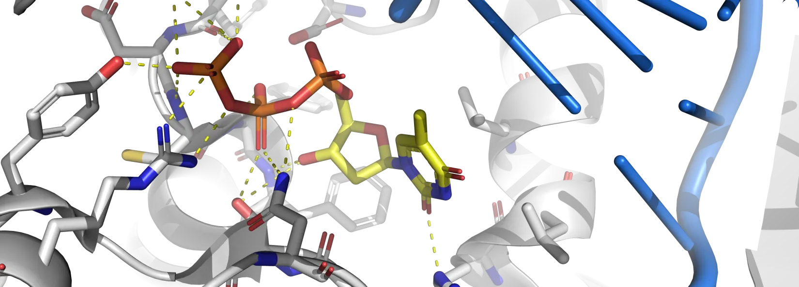
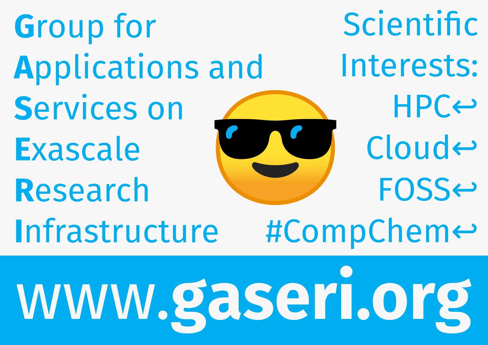

# O grupi

!!! info
    Ova je stranica također dostupna [na engleskom jeziku](../en/index.md).

!!! quote
    > Nekad smo stajali u krugu. Dim se dizao sporo. Mešao sa pričama koje su kružile iz ruke u ruku. Pogledi su se razumeli bez reči. Imena su se izgovarala glasno. Sa sigurnošću da sutra postoji. Krug je bio zatvoren. Čvrst. Naš. Verovalo se da nas je baš to držalo na okupu. Danas kruga nema. Ili ima, ali ne prepoznajem njegov oblik. Neka imena se više ne pominju. Ne zato što su zaboravljena, nego zato što bole. Neka su ostala zaključana u tišini. Neka su promenila jezik. Neka gledaju svet kroz rešetke, a neka guraju kolica po parku i prave se da nikad nisu stajala ovde gde mi sada stojimo. Krug se širi. I puca. Menja lice. Nije više to to. Nikad i neće biti. Sećanja su kao taj sneg. Padnu ti na rame pa ne znaš da l' da ih otreseš ili poneseš sa sobom. Vetar ih raznosi po mislima, vraća slike koje nisi zvao. Smeh koji je trajao prekratko. Uverenje da kontrola pripada onome ko se ne boji, a niko tada nije hteo da prizna strah. Crni sneg i dalje pada. Metar po metar. I svaki put kad pomisliš da si se izvukao, vetar dune i podseti te gde si rastao, ko si bio. I koliko toga si ostavio iza sebe

    -- [Faberge](https://www.instagram.com/faberze_/) i [Jovan Jovanović](https://www.instagram.com/reel/DX1SKSlIhKI/) -- [Krug - Skit](https://genius.com/Faberge-and-jovan-jovanovic-krug-skit-lyrics), album [Crni Sneg](https://youtu.be/wORaj9jMUsY?list=PL78w5GiH56nFnHOoHopvht4-nTWxcJcdw), [Bassivity Digital](https://www.bassivitygroup.com/#digital), 2026.

**Grupa za aplikacije i usluge na eksaskalarnoj istraživačkoj infrastrukturi** (engl. *Group for Applications and Services on Exascale Research Infrastructure*, kraće GASERI) je istraživačka, razvojna i nastavna jedinica na [Fakultetu informatike i digitalnih tehnologija](https://www.inf.uniri.hr/) i [Medicinskom fakultetu](https://medri.uniri.hr/) [Sveučilišta u Rijeci](https://uniri.hr/).

## Uvodna prezentacija

[Svijetla pozadina](../downloads/gaseri-introductory-presentation-light-background.pdf){ .md-button } [Tamna pozadina](../downloads/gaseri-introductory-presentation-dark-background.pdf){ .md-button .md-button--primary }

## Interesi

Superračunalo, također poznato kao računalo visokih performansi (engl. *high performance computer*, kraće HPC), nudi mnogo veće performanse od osobnog računala. Performanse se obično mjere brojem operacija s pomičnim zarezom u sekundi (engl. *floating-point operations per second*, kraće FLOPS) koje računalo može izvesti; osobno računalo može izvesti do desetke teraFLOPS-a, dok moderni HPC-i mogu izvesti stotine petaFLOPS-a, što rezultira faktorom ubrzanja od otprilike deset tisuća.

Takva su ubrzanja omogućena korištenjem modela paralelnog i distribuiranog programiranja. S performansama superračunala koje se približavaju exaFLOPS-u, arhitektura računala postaje sve heterogenija, dok su modeli programiranja sve složeniji. Konačno, HPC se sve više nudi kao usluga u oblaku, što predstavlja vlastiti skup izazova. Mnoga znanstvena područja ovise o korištenju superračunala za svoje izračune; posebno se računalna biokemija oslanja na superračunala za proučavanje i predviđanje strukture proteina, kao i njihove dinamike, funkcije i reaktivnosti s malim molekulama (ligandima).

Glavni interes Grupe za aplikacije i usluge na eksaskalarnoj istraživačkoj infrastrukturi je primjena eksaskalarnog računarstva za rješavanje problema u računalnoj biokemiji. Cilj je dizajnirati algoritme boljih performansi i ponuditi njihove implementacije za akademsku i industrijsku upotrebu. Računalni kemičari koji imaju pristup boljim alatima mogu proučavati postojeće sustave brže, detaljnije ili umjesto njih proučavati veće sustave.

Specifični fokusi u sadašnjosti su distribuirane arhitekture baza podataka kemijskih spojeva koje zadovoljavaju zahtjeve skalabilnosti i pouzdanosti visoko propusnih virtualnih pregleda, napredak algoritama molekulske dinamike koji im omogućuje učinkovito korištenje eksaskalarnih superračunalnih resursa te uspostavljanje hrvatskog centra kompetencija za HPC.

## Metode

Grupa koristi i dalje razvija metode za predviđanje pristajanja liganda na protein, simulaciju molekularne dinamike, Monte Carlo metodu i druge računalne tehnike za proučavanje statičkih i dinamičkih svojstava biomolekulskih sustava. Interdisciplinarni pristup u grupi objedinjuje stručnost fizičara, matematičara, informatičara i računalnih znanstvenika. Temeljna motivacija je raditi bolju znanost na način otvorenog izbora; znanost je u suštini otvorena i takva bi trebala i ostati. Način otvorenog izvora uključuje otvorene formate datoteka, slobodni softver i softver otvorenog koda, otvoreni hardver, obrambeno licenciranje patenata i otvoreni pristup objavljenim radovima.

## Povijest

Grupa je započela s radom u listopadu 2021. Izgrađena je na nasljeđu Laboratorija za računalne mreže, paralelizaciju i simulaciju (engl. *Computer Networks, Parallelization, and Simulation Laboratory*, kraće CNPSLab) koji je do listopada 2021. bio dio [Odjela za informatiku](https://www.inf.uniri.hr/).

Na zasebnoj stranici možete pročitati [više o povijesti grupe](povijest.md).

## Poster

[Preuzimanje u formatu PDF (A3, položeno)](../images/gaseri-poster.pdf)
