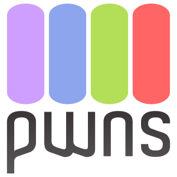

# Istraživanje i razvoj

## Razvoj online kolegija Optimizacija programskog koda (Code optimization) na Sveučilištu u Rijeci u akademskim godinama 2020./2021. i 2021./2022.

### Podaci o osobama odgovornim za provedbu projekta

#### VODITELJ PROJEKTA (u prilogu dostaviti CV)

**Ime i prezime:** dr. sc. Vedran Miletić

**Sastavnica Sveučilišta u Rijeci:** Odjel za informatiku

**Znanstveno-nastavno zvanje:** Znanstveni suradnik, zaposlen na radnom mjestu višeg predavača

**e-mail:** vmiletic@inf.uniri.hr

#### IZVODITELJI PROJEKTA

**1.**

**Ime i prezime:** dr. sc. Vedran Miletić

**Sastavnica Sveučilišta u Rijeci:** Odjel za informatiku

**Zvanje:** Znanstveni suradnik, zaposlen na radnom mjestu višeg
predavača

**E-mail:** vmiletic@inf.uniri.hr

**Uloga u projektu:** Voditelj projekta i izvoditelj projekta (nositelj
kolegija i asistent)

**2.**

**Ime i prezime:** Mia Doričić

**Sastavnica Sveučilišta u Rijeci:** Odjel za informatiku

**Zvanje:** Studentica, demonstratorica

**E-mail:** mia.doricic@student.uniri.hr

**Uloga u projektu:** Pomoćnica u izradi zadataka za vježbe i domaće zadaće

### Podaci o kolegiju (ako je postojeći)

**Naziv kolegija:** Optimizacija programskog koda (*Code optimization*)

**Nositelj kolegija:** doc. dr. sc. Miran Pobar / dr. sc. Vedran Miletić

**Sastavnica Sveučilišta u Rijeci:** Odjel za informatiku

**Studijski program:** Preddiplomski studij informatike

**Godina studijskog programa:** 3

**Status kolegija:** **Obvezan**/Izborni

**ECTS bodovi kolegija:** 5

**Broj sati (P+S+V):** 30+0+30

#### Dosadašnji način izvođenja nastave

Kolegij će se prvi put izvoditi u akademskoj godini 2021./2022. kao i preostali kolegiji na 3. godini novog preddiplomskog studijskog programa "Informatika" čija je izvedba započela akademske godine 2019./2020.

#### Razina sadašnje primjene alata e-učenja

Kolegij se dosad nije izvodio, ali planirana je bila razina A prema "Preporukama za izradu obrazovnih materijala za e-učenje".

#### Dodatne informacije o kolegiju (navesti podatke za koje predlagatelji smatra da su važni za projekt)

Ovaj kolegij se bavi tehničkim izazovima područja suvremenog digitalnog društva, što ga čini posebno prikladnim za YUFE koji navodi upravo "Digitano društvo" kao jedno od strateških područja. Kolegij upoznaje studente s temeljnim načelima optimizacije programske podrške koja stoji u pozadini sveprisutnog računarstva u društvu. U suvremeno doba se optimizacija programske podrške primjenjuje na računalima svih veličina i namjena: malenim uređajima koji čine internet stvari, pametnim telefonima i satovima, računalima koja se koriste u kasama i bankomatima, osobnim računalima na kojima se izvode web preglednici i igre, budućim samovozećim automobilima, velikim superračunalima kao što je Bura na Sveučilištu u Rijeci i drugim.

Kolegij je dio modula "Razvoj programske potpore" preddiplomskog studija informatike i formalno nasljeđuje kolegije iz područja programiranja na 1. i 2. godini preddiplomskog studija s obzirom na to da zahtijeva predznanje iz programiranja, struktura podataka i algoritama. Slijedom prisustva kolegija koji pokrivaju ta predznanja na raznim studijima u području prirodnih i tehničkih znanosti moguće je ovaj kolegij, osim studentima informatike i računarstva, ponuditi i drugim zainteresiranim studentima koji imaju odgovarajuća predznanja.

Svi računalni programi koje će studenti koristiti tijekom izvedbe kolegija bit će odabrani tako da se radi o slobodnoj programskoj podršci, odnosno programskoj podršci otvorenog koda (engl. *free and open source software*). To će olakšati izvedbu i otvoriti kolegij prema svim zainteresiranim studentima jer neće biti potrebe za nabavkom specijalizirane i često vrlo skupe komercijalne programske podrške, bilo od strane sveučilišta, bilo od strane studenata samih.

### Opis projekta razvoja online kolegija

#### Naziv kolegija

Optimizacija programskog koda (*Code optimization*)

#### Opis očekivanih ulaznih kompetencija studenata (preduvjeti za upis kolegija, uključujući potrebnu CEFR razinu poznavanja engleskog jezika)

Preduvjet za upis kolegija su položeni predmeti koji obrađuju programiranje, strukture podataka i algoritme neovisno o programskom jeziku. Potrebna CEFR razina poznavanja engleskog jezika je najmanje B2.

#### Ukupni broj studenata koji mogu pohađati kolegij u jednoj izvedbi

50

#### Broj studenata kojima se kolegij može ponuditi

- **u sklopu YUFE:** 10
- **u sklopu interne mobilnosti:** 10

#### Početak izvedbe kolegija u 2020./21. (navesti datum)

Početak zimskog semestra akademske godine 2021./2022., približno 1. listopad 2021.

#### Očekivani ishodi učenja na kolegiju

Nakon učenja i izvršavanja svih kolegijem predviđenih aktivnosti i
obaveza student će moći:

I1. Analizirati svojstva koja omogućuju transformaciju programskog koda i prikazati programski kod grafom toka.  
I2. Prikazati razlike između lokalne i globalne optimizacije te identificirati gdje se svaka od njih primjenjuje.  
I3. Provesti klasičnu analizu toka podataka, alokaciju registara bojenjem registara i eliminaciju zajedničkih podizraza.  
I4. Opisati način rada optimizacije višeg nivoa i primijeniti postojeće optimizacije.  
I5. Opisati razlike optimizacija višeg nivoa i optimizacija ovisnih o ciljnoj arhitekturi.  
I6. Provesti odabir instrukcije.  
I7. Analizirati problem redoslijeda faza optimizacije.

#### Ciljevi i sadržaj kolegija (max 250 riječi)

Cilj ovog kolegija je uvesti temeljna načela i metode optimizacije programskog koda na razini apstraktne sintakse, grafa toka programa i izvršnog (strojnog) koda.

**Sadržaj kolegija:**

- Pregled optimizirajućeg prevoditelja programskog jezika. Optimizacija po dijelovima. Analiza svojstava koja omogućuju transformaciju. Graf toka i reprezentacija programskih koncepata. Problem redoslijeda faza optimizacije.
- Vrste optimizacije. Lokalna optimizacija: optimizacija kroz okance, zakazivanje instrukcija. Globalna optimizacija: zajednički podizrazi, kretanje koda. Interproceduralna optimizacija. Graf poziva.
- Klasična analiza toka podataka. Algoritmi na grafovima, skupovi živih i dostupnih varijabli. Alokacija registara bojenjem registara. Eliminacija zajedničkih podizraza. Prolijevanje u memoriju; baratanje privremenim izrazima uvedenim kod eliminacije zajedničkih podizraza. Anomalije toka podataka. Oblik statičke jednostruke dodjele vrijednosti varijablama.
- Pregled optimizacija višeg nivoa. Analiza memorijskih lokacija na koje varijable pokazuju i analiza pseudonima.
- Optimizacija ovisna o ciljnoj arhitekturi. Odabir instrukcije. Zakazivanje instrukcija i povezani problem redoslijeda faza optimizacije.

#### Pristupi učenju i poučavanju -- stjecanju ishoda učenja

Ishodi učenja stječu se kroz više aktivnosti:

1. **Prisutnost na online nastavi** (1 ECTS) -- redovito praćenje i proučavanje online materijala u tekstualnom i multimedijskom obliku (slike, prezentacije, asinkrone video lekcije, sinkrone video konferencije, video resursi)
2. **Pisani osvrti** (0,5 ECTS) -- kraći pisani osvrti na zadanu temu uz korištenje danih i samostalno pronađenih izvora; studenti daju procjenu nekolicine tuđih radova, a nastavnik ocjenjuje sve radove
3. **Domaće zadaće** (1,5 ECTS) -- zadaci iz gradiva vježbi zadani za samostalno rješavanje studenata uz predaju rješenja u danom roku
4. **Praktični rad** (1 ECTS) -- grupni ili pojedinačni rad na implementaciji danih tehnika optimizacije programskog koda te dokumentiranje, testiranje i prezentacija implementacije
5. **Online testovi** (1 ECTS) -- provjere znanja gradiva predavanja u obliku pitanja višestrukog izbora, kratkog odgovora, uparivanja, nadopunjavanja riječi i sl.

#### Pristupi vrednovanju i ocjenjivanju (navesti načine provođenja vrednovanja i ocjenjivanja)

Provjera ishoda učenja vrši se preko sljedećih procjena znanja:

1. **Prisutnost na online nastavi** (I1--I7): Provjera tjedne studentske aktivnosti, sudjelovanja i vremena provedenog u radu na online kolegiju (npr. izvještaji i statistika iz sustava za e-učenje Merlin ili Canvas).
2. **Pisani osvrti** (I1, I2, I4, I5, I7): U pisanim osvrtima na zadanu temu student pokazuje razumijevanje gradiva iz online lekcije korištenjem radionice s vršnjačkom procjenom u okviru suvremenog alate za e-učenje (npr. Merlin, Canvas). Vrednovat će kvaliteta obrade teme i razumijevanje proučenih izvora, kao i kvaliteta procjene radova drugih studenata nakon predaje vlastitog osvrta. Primjeri tema za pisanje osvrta mogu biti "Odaberite tri optimizacijske tehnike implementirane u nekom program prevoditelju otvorenog koda i opišite njihov način rada" ili "Usporedite posredne jezike LLVM IR i GCC GENERIC/GIMPLE".
3. **Domaće zadaće** (I1, I2, I3, I4, I6): Praktična provjera znanja kod koje se traži da student analizira i transformira zadani programski kod te koristi i po potrebi prilagođava postojeće optimizacije. Primjeri zadataka mogu biti "Na zadanom programskom kodu provedite eliminaciju zajedničkih podizraza" ili "Pronađite sve optimizacije među onima obrađenima na kolegiju koje se mogu uspješno provesti na zadanom programskom kodu".
4. **Praktični rad** (I1, I2, I3, I4, I6): U praktičnom radu studenti u grupama po troje, dvoje ili pojedinačno prema zadanim uputama implementiraju dane tehnike optimizacije programskog koda, pišu dokumentaciju i vrše testiranje vlastite implementacije. Primjerice, teme praktičnog rada mogu biti "Implementacija odmotavanja petlje for" ili "Implementacija brojanja globalnih vrijednosti".
5. **Online testovi** (I1, I2, I4, I5, I7) Online provjera znanja u kojima student pokazuje razumijevanje teorijskih koncepata optimizacije programskog koda.

#### Približan vremenski plan nastavnih aktivnosti i opterećenja studenata (navesti ukupno trajanje kolegija u tjednima, navesti veće nastavne cjeline i planirane nastavne aktivnosti te pripadajuće procijenjeno vremensko opterećenje studenata u satima; navesti planirane provjere znanja)

Ukupno trajanje kolegija je 15 tjedana (jedan semestar).

| Nastavna cjelina | Nastavne aktivnosti | Trajanje / tj. | Opterećenje studenta / h |
| ---------------- | ------------------- | -------------- | ------------------------ |
| 1. | Pregled optimizirajućeg prevoditelja programskog jezika. Optimizacija po dijelovima. Analiza svojstava koja omogućuju transformaciju | 1 | 5 |
| 2. | Graf toka i reprezentacija programskih koncepata. Problem redoslijeda faza optimizacije. **1. pisani osvrt** | 1 | 7 |
| 3. | Vrste optimizacije. Lokalna optimizacija: optimizacija kroz okance, zakazivanje instrukcija | 1 | 5 |
| 4. | Globalna optimizacija: zajednički podizrazi, kretanje koda. **1. domaća zadaća** | 1 | 14 |
| 5. | Interproceduralna optimizacija. Graf poziva | 1 | 5 |
| 6. | **1. test** | 1 | 14 |
| 7. | Klasična analiza toka podataka. Algoritmi na grafovima, skupovi živih i dostupnih varijabli. **2. pisani osvrt** | 1 | 7 |
| 8. | Alokacija registara bojenjem registara. Eliminacija zajedničkih podizraza | 1 | 5 |
| 9. | Prolijevanje u memoriju; baratanje privremenim izrazima uvedenim kod eliminacije zajedničkih podizraza. Anomalije toka podataka. **2. domaća zadaća** | 1 | 14 |
| 10. | Oblik statičke jednostruke dodjele vrijednosti varijablama. **Odabir teme praktičnog rada** | 1 | 6 |
| 11. | Pregled optimizacija višeg nivoa. **Izrada praktičnog rada.** | 1 | 11 |
| 12. | Analiza memorijskih lokacija na koje varijable pokazuju i analiza pseudonima. **Izrada praktičnog rada** | 1 | 11 |
| 13. | Optimizacija ovisna o ciljnoj arhitekturi. Odabir instrukcije. **Izrada praktičnog rada.** | 1 | 11 |
| 14. | Zakazivanje instrukcija i povezani problem redoslijeda faza optimizacije. **Izrada praktičnog rada** | 1 | 11 |
| 15. | **2. test.** **Predaja praktičnog rada** | 1 | 14 |

#### Vremenski plan izvršenja projekta (navesti aktivnosti i rezultate pojedinih faza projekta)

Projekt će se provesti u 7 faza.

| Faza | Trajanje | Aktivnosti i rezultati |
| ---- | -------- | ---------------------- |
| 1. | 15. 11. 2020. -- 31. 1. 2021. | **Aktivnosti:** Nabava literature za izradu online lekcija. Nabava opreme koja će, uz postojeća računala na Odjelu za informatiku, biti korištena za izučavanje optimizacije programskog koda na praktičnim primjerima te usporedbu optimizacija programskog koda na različitim arhitekturama. Priprema razvojne okoline (program prevoditelji, programi za ispravljanje pogrešaka, integrirana razvojan okruženja i dr.) na postojećoj i nabavljenoj opremi. **Rezultati:** Nabavljena literatura i oprema; postavljena razvojna okolina. |
| 2. | 1. 2. 2021. -- 28. 2. 2021. | **Aktivnosti:** Proučavanje literature i priprema nacrta sadržaja online lekcija. Izrada detaljnog izvedbenog nastavnog plana kolegija. **Rezultati:** Pripremljen nacrt sadržaja online lekcija. Izrađen detaljni izvedbeni nastavni plan. |
| 3. | 1. 3. 2021. -- 31. 7. 2021. | **Aktivnosti:** Izrada tekstualnih i audiovizualnih sadržaja online lekcija i primjera riješenih zadataka na engleskom jeziku. **Rezultati:** Izrađeni tekstualni i audiovizualni materijali spremni za postavljanje na Merlin. |
| 4. | 1. 9. 2021. -- 30. 9. 2021. | **Aktivnosti:** Stvaranje e-kolegija na Merlinu i postavljanje sadržaja izrađenog u ranijoj fazi. Izrada uputa za instalaciju programske podrške i konfiguraciju razvojne okoline na strani studenta i postavljanje uputa na Merlin. **Rezultati:** E-kolegij na Merlinu ispunjen ranije izrađenim tekstualnim i audiovizualnim sadržajima. Upute za instalaciju programske podrške i konfiguraciju razvojne okoline napisane i postavljene na Merlin. |
| 5. | 1. 10. 2021 -- 31. 1. 2022. | **Aktivnosti:** Izvedba online kolegija. **Rezultati:** Održan online kolegij. |
| 6. | 1. 2. 2022. -- 28. 2. 2022. | **Aktivnosti:** Stvaranje i postavljanje na Merlin anonimne ankete o zadovoljstvu kolegijem. Ispitivanje zadovoljstva studenata koji su odslušali kolegij. **Rezultati:** Provedena anketa. |
| 7. | 1. 3. 2022. -- 31. 3. 2022. | **Aktivnosti:** Analiza rezultata ankete o studentskom zadovoljstvu. Analiza podataka o uspješnosti studenata na pojedinim aktivnostima online kolegija. Pisanje osvrta na održani online kolegij i postavljanje ciljeva za buduće izvedbe kolegija. **Rezultati:** Izvješće o održanom online kolegiju. |

#### Okvirni financijski plan projekta (troškovi rada, nabava opreme, licence, itd.)

Izvedba kolegija temelji na slobodnoj programskoj podršci, odnosno programskoj podršci otvorenog koda (engl. *free and open source software*) čime se izbjegavaju troškovi licenciranja programske podrške. Stoga je moguće sve dostupne financijske resurse iskoristiti za nabavku literature, opreme i lekturu nastavnih materijala.

#### Plan razvoja projekta nakon završetka financiranja (opisati kako će se rezultati/završni proizvod projekta nastaviti koristiti i dalje razvijati u kolegiju)

Rezultat projekta bit će razvijeni i održani online kolegij *Code optimization* na engleskom jeziku dostupan svim studentima Sveučilišta u Rijeci i studentima unutar mreže YUFE koji će ojačati ponudu kolegija u strateški definiranom području "Digitalno društvo".

Točan plan daljnjeg razvoja online kolegija bit će donesen nakon prve godine izvođenja i analize rezultata o studentskom zadovoljstvu u skladu sa studentskim prijedlozima. Postoje razne mogućnosti daljnjeg razvoja, npr. proširenje u smjeru detaljnijeg izlaganja o specifičnostima pojedinih arhitektura (prvenstveno GPU i FPGA čija je upotreba u porastu i to specijalno u područjima znanstvenog računanja i rudarenja kriptovaluta), izučavanje analiza i transformacija koda koje omogućuju automatsku paralelizaciju izvođenja te optimizacija programskog koda za procesore koji u sebi imaju ugrađenu zaštitu memorije i odvajanje softvera. Kako se radi o području koje se aktivno razvija, važno je pratiti istraživačke i industrijske trendove te dopunjavati sadržaj materijala online kolegija u skladu s njima.

Nabavljena oprema koristit će se u prvoj godini i narednim godinama za prikaz rada metoda optimizacije programskog koda na različitim arhitekturama koje se koriste u sveprisutnim računalima oko nas. Zbog vrlo brzog napretka računalne tehnologije bit će potrebno nakon 3 do 5 godina izvođenja kolegija ponovno nabaviti tada dostupnu opremu kako bi studenti na kolegiju kontinuirano radili na aktualnim arhitekturama i stjecali znanja relevantna za njihovo buduće zaposlenje za što će biti potrebno osigurati sredstva iz drugih izvora.

Materijali stvoreni u okviru ovog online kolegija nastavit će se koristiti i ubuduće, ali će se i nadograđivati kako bi bili usklađeni s nabavkom opreme i promjenama korištene programske podrške. Pored toga, stečena iskustva, napravljeni nastavni materijali i nabavljena oprema bit će korišteni za razvoj i unaprjeđenje i drugih kolegija na Odjelu za informatiku gdje je to moguće.

## Superračunalo Malina

**Inicijativa koja predlaže projekt:** InfUniri MPI

**Mjesto i vrijeme provedbe projekta:** Rijeka, Hrvatska, od 20.12.2013. do 01.06.2014.

**Znanstveno ili stručno područje projekta:** Tehničke znanosti

**Voditelj projektnog tima ili prijavitelj pojedinac, ukoliko se radi o samostalnom projektu jednog studenta:** Tomislav Šubić

**Članovi projektnog tima:** Edvin Močibob

### Opis udruge/inicijative

Inicijativa se zalaže za promicanje i edukaciju studenata o superračunalima i distribuiranoj obradi podataka. Za sada se sastoji samo od dvojice studenata. Članovi su Edvin Močibob i Tomislav Šubić; obojica studenti jednopredmetne informatike na Odjelu za informatiku Sveučilišta u Rijeci.

### Detaljan opis projekta

Postoji nekoliko glavnih komponenti superračunala, odnosno računalnog clustera; računalni hardver, operacijski sustav, treba nam nešto što će povezati sva ta računala i treba nam način kako će ona međusobno komunicirati. Računalo koje namjeravamo koristiti je Raspberry Pi. To je malo računalo veličine kreditne kartice. Ono se sastoji samo od jedne računalne ploče sa svim komponentama. Sposobno je "vrtjeti" Linux operacijski sustav. Procesor koji ono koristi zasniva se na ARM tehnologiji i radi na 700 Mhz. Najvažniji adut i razlog zbog kojeg smo odabrali ovo računalo jest njegova cijena. Naime, za ovaj projekt potrebno nam je 64 komada stoga cijena itekako utječe na izvedbu projekta. Jedan Raspberry Pi košta 240 kn (cijena za kupnju više od 50 kom.). Zbog te cijene Raspberry Pi dolazi bez tvrdog diska i napajanja. Kao tvrdi disk koristi ćemo SD karticu. Nakon razmatranja različitih opcija odlučili smo se za varijantu od 16GB. Cijena svake kartice iznosi oko 100 kn. Ukupno će naše superračunalo imati 1TB memorije. Svakom računalu na radnom naponu od 5V (pri punom opterećenju) struja iznosi 700ma, odnosno najveća potrošnja mu je 3,5W. Prema tim kriterijima moramo odabrati pravo napajanje. Najbolje (i najjeftinije) rješenje su dva napajanja, od kojih svako pri 5V ima izlaznu struju od 30A, što znači da je svako napajanje dovoljno za 32 računala. Napajanje koje smo odlučili uzeti je Xilence 600W GE s cijenom od 530 kn. Operacijski sustav mora biti Linux distribucija; Raspbian koji je specifično napravljen za Raspberry Pi ili Arch linux. Razne distribucije možemo isprobavati kada složimo računalo te onda odlučiti koja nam najviše odgovara. Ono što planiramo složiti je takozvani Beowulf cluster. To je računalni cluster napravljen od hardverski istovjetnih čvorova -- računala. Nadalje, sva se ta računala treba umrežiti. Arhitekturu namjeravamo organizirati tako da postoji jedan glavni čvor koji upravlja svim ostalim čvorovima. Koristit ćemo switcheve; na svaki switch mogu se spojiti 24 čvora, što bi značilo da nam trebaju barem 3 switcha. Svakom je cijena oko 400 kn. Kako bi spojili računala sa switchevima potrebni su nam ethernet kablovi. Svakom kabelu je cijena 5 kn. Uza sve navedene komponente treba nam alat kojim ćemo obradu podataka izvršavati paralelno po svim čvorovima. Najbolji alat za to je MPI (engl. Message passing interface). To je protokol koji nam omogućava da pišemo programe za paralelne računalne sustave. Taj dio smo obrađivali na studiju, te nam je to bila i inspiracija za ideju i pokretanje ovog projekta.

Kako bi sve to mogli fizički držati na okupu, trebamo dizajnirati i napraviti kućište. Zbog povoljnije cijene cilj je napravili glavnu konstrukciju od lima ili drva. Računala bi međusobno posložili koristeći posebne vijke za tu svrhu (engl. threaded hex spacers). Rado bi zbog kvalitete to radili sa čeličnim vijcima, no oni su gotovo dvostruko skuplji nego plastični, cijena kompleta od 100 komada je 430 kuna, a nama bi trebalo 120 komada. Ovakav sustav treba održavati hladnim za što bi u samo kućište ugradili ventilatore. Potrebno nam je najmanje 2, a jedan komad je oko 50-ak kuna.

Nakon sastavljenog superračunala slijedi proučavanje, njegovo poboljšavanje i uvijek moguće unaprjeđenje sustava.

### Ciljevi projekta

(Opis mjerljivih rezultata projekta s posebnim osvrtom na ostvarenje ciljeva Zaklade prema Pravilniku o uvjetima, načinu i postupku za dodjelu sredstava za ostvarivanje svrhe Zaklade Sveučilišta u Rijeci te prema Prioritetnim i strateškim ciljevima Zaklade 2008. -- 2012.)

Rezultat projekta je izgradnja jeftinog superračunala koje bilo dostupno ne samo nama -- studentima koji ga namjeravaju napraviti, nego i našim kolegama te ostatku akademske zajednice. Osnovna motivacija za prijavu ovog projekta bila je želja da se pobliže nauči kako izgleda i radi superračunalo (tj. jedna ekonomičnija verzija superračunala), dakle jednostavna želja za proširivanjem znanja o računalima. Nadalje, kao što bi na takvom superračunalu programirali i izvodili kompleksne izračune namijenjene baš za takvu vrstu računala, isto bi omogućili i našim kolegama (ne samo na Informatici nego i na drugim studijima).

Znanstvena istraživanja podrazumijevaju matematičku analizu i obradu podataka. Kada je količina takvih podataka velika njihova obrada može potrajati. Ni jedan znanstvenik ni akademik ne želi čekati više nego što treba na obradu podataka (ipak je vrijeme jedan od najvažnijih resursa za akademike). Cilj projekta je naučiti principe rada na superračunalima i isto omogućiti ostalim zainteresiranim studentima. Naime obrada podataka i ubrzanje te obrada nije trivijalan zadatak te takvo znanje može biti od velike koristi -- takvo znanje student može koristiti na svim budućim projektima/istraživanjima gdje se susreće s velikim obujmom podataka.

Na našem studiju postoje kolegiji kao što su Operacijski sustavi (1 i 2) i Distribuirani sustavi čiji je nastavni plan direktno povezan s ovim projektom, pa bi se naše superračunalo moglo koristiti i u sklopu kolegija. Ovakav projekt ima puno potencijala. Mogle bi se organizirati radionice s ciljem upoznavanja studenata sa superračunalima. Računalo bi se moglo koristiti i u nekim budućim studentskim projektima. Važni faktori su i modularnost i skalabilnost ovakvog sustava. Možemo uvijek nadograđivati i poboljšavati takvo računalo.

### Plan provedbe projekta (prikaz sukladno vremenu provedbe projekta)

1. Faza (od 19.2. do 19.3.)

    - nabava svih komponenti i materijala

2. Faza (od 19.3. do 20.4.)

    - slaganje komponenti
    - instaliranje i podešavanje sustava
    - pisanje izvještaja

3. Faza (od 20.4. do 1.6.)

    - pisanje programa za obradu podataka i proučavanje

### Prikaz planirane evaluacije projekta

Uz detaljan pisani izvještaj u kojemu bi naveli točan proces izrade superračunala, dodali bi i detaljan popis troškova izrade te primjere obrada/programa koje smo uspješno izveli na njemu. U izvještaju bi uz detaljne specifikacije dodali i slike procesa izrade te krajnjeg, složenog, superračunala.

Jednom izgrađeno superračunalo namjeravamo dalje koristiti kod programiranja za vlastite projekte te omogućiti isto kolegama. Tako da će kad god bude moguće superračunalo biti dostupno svima kojima se žele educirati o rada na superračunalima, pa tako i Vama koji bi se mogli osobno uvjeriti u realiziranost našeg projekta.

### Opis načina vidljivosti Zaklade Sveučilišta u Rijeci tijekom projekta

Vidljivost Zaklade Sveučilišta u Rijeci izražavati će kroz naljepnice logotipa i naravno kroz naglašavanje sponzorstva u izjavama javnosti preko društvenih mreža i svake ostale prilike ako se ona ukaže.

## Fotonički WDM mrežni simulator (Photonic WDM Network Simulator, PWNS)

### Pregled

Fotonički WDM mrežni simulator (Photonic WDM Network Simulator, PWNS) proširenje je [mrežnog simulatora ns-3](https://www.nsnam.org/) koje omogućuje simulaciju optičkih transportnih mreža. Proširenje je inspirirano optičkim WDM mrežnim simulatorom (Optical WDM network simulator, OWns), proširenjem sa sličnim ciljevima implementiranom u ns-2 i opisanom u \[6\]. Sam naziv proširenja PWNS je parodija na OWns; kako *[own](https://www.urbandictionary.com/define.php?term=own)* u *[leetspeaku](https://www.urbandictionary.com/define.php?term=leet%20speak)* postaje *[pwn](https://www.urbandictionary.com/define.php?term=pwn)*, tako *owns* postaje *pwns*.

### Značajke

PWNS sadrži modele za sljedeće komponente optičke transportne mreže \[5\]:

- rubni mrežni uređaji,
- uređaji jezgrene mreže,
- fizička sučelja,
- kanali, i
- upravljačka ravnina.

Osim toga, PWNS nudi modele za sljedeće fizičke i virtualne entitete \[4\]:

- fizički kabel koji sadrži jedno ili više optičkih vlakana,
- grupa veza s dijeljenim rizikom (engl. *shared risk link group*) koja sadrži dijelove dva ili više kabela koji dijele fizičku lokaciju,
- svjetlosni put koji prolazi kroz jedan ili više mrežnih uređaja,
- logički kanal koji ima radni i rezervni put određene valne duljine,
- modeli kvarova i popravaka kvarova na vezama, i
- praćenje vremena rada i zastoja u radu mreže.

### Dostupnost

Planirani razvoj PWNS-a završen je 2015. godine obranom doktorata \[1\]. Posljednja verzija PWNS-a dostupna je u obliku izvornog koda [na zahtjev](https://vedran.miletic.net/#contact), a moguće je da će pojedini njegovi dijelovi u budućnosti biti uključeni u osnovni kod ns-3-a. Prijave pogrešaka i zakrpe koje ih ispravljaju ili dodaju nove značajke su uvijek dobrodošli.

### Reference

Ako koristite PWNS u svom radu, molimo vas da citirate barem radove \[4\] i \[5\].

- \[1\] Miletić, V. [Method for optimizing availability of optical telecommunication network in presence of correlated failures](https://vedran.miletic.net/files/phd-thesis-vedran-miletic.pdf). PhD thesis defended at Faculty of Electrical Engineering and Computing, University of Zagreb, 8th June 2015.
- \[2\] Miletić, V., Šubić, T. & Mikac, B. [Optimizing maximum shared risk link group disjoint path algorithm using NVIDIA CUDA heterogeneous parallel programming platform](https://ieeexplore.ieee.org/document/6987645). in Proceedings on the 2014 X International Symposium on Telecommunications (BIHTEL) (ed. Mrdović, S.; University of Sarajevo, Sarajevo, Bosnia and Herzegovina), 1–6 (IEEE, 2014). [doi:10.1109/BIHTEL.2014.6987645](https://doi.org/10.1109/BIHTEL.2014.6987645)
- \[3\] Miletić, V., Maniadakis, D., Mikac, B. & Varoutas, D. [On the influence of the underlying network topology on optical telecommunication network availability under shared risk link group failures](https://ieeexplore.ieee.org/document/6816135). in Proceedings of the 2014 10th International Conference on the Design of Reliable Communication Networks (DRCN) (ed. Van Daele, P.; University of Ghent, Ghent, Belgium), 1–8 (IEEE, 2014). [doi:10.1109/DRCN.2014.6816135](https://doi.org/10.1109/DRCN.2014.6816135)
- \[4\] Miletić, V., Mikac, B. & Džanko, M. [Impact evaluation of physical length of shared risk link groups on optical network availability using Monte Carlo simulation](https://ieeexplore.ieee.org/document/6582897). in Proceedings of the 2013 18th European Conference on Networks and Optical Communications (NOC) and 8th Conference on Optical Cabling & Infrastructure (OC&I) (ed. Leitgeb, E.; Technical University Graz, Graz, Austria), 249–256 (IEEE, 2013). [doi:10.1109/NOC-OCI.2013.6582897](https://doi.org/10.1109/NOC-OCI.2013.6582897)
- \[5\] Miletić, V., Mikac, B. & Džanko, M. [Modelling optical network components: A network simulator-based approach](https://ieeexplore.ieee.org/document/6412064). in Proceedings on the 2012 IX International Symposium on Telecommunications (BIHTEL) (ed. Mrdović, S.; University of Sarajevo, Sarajevo, Bosnia and Herzegovina), 1–6 (IEEE, 2012). [doi:10.1109/BIHTEL.2012.6412064](https://doi.org/10.1109/BIHTEL.2012.6412064)
- \[6\] Wen, B., Bhide, N. M., Shenai, R. K. & Sivalingam, K. M. [Optical wavelength division multiplexing (WDM) network simulator (OWns): architecture and performance studies](https://citeseerx.ist.psu.edu/document?repid=rep1&type=pdf&doi=4bb0395e580baa22ba96969c54f966248d37a43f). SPIE Optical Networks Magazine, 2(5), 16-26 (2001).

## Razvoj e-kolegija Računalne mreže 2 na Sveučilištu u Rijeci u akademskoj 2011/2012. godini

**Naziv projekta (naziv kolegija):** Računalne mreže 2

**Dodatne informacije o kolegiju:** Kolegiji Računalne mreže 1 i Računalne mreže 2 spadaju među temeljne kolegije studija informatike i osnova su za mnoge kolegije koji slijede u nastavku studija, u koje spadaju Multimedijski sustavi, Dinamičke web aplikacije 1 i Dinamičke web aplikacije 2 s preddiplomskog studija informatike te Distribuirani sustavi, Upravljanje mrežnim sustavima, Upravljanje znanjem i Informacijska tehnologija i društvo s diplomskog studija informatike.

**Trajanje projekta:** 06.02.2012. -- 29.06.2012.

**Voditelj projekta:** prof. dr. sc. Mario Radovan

**Izvoditelji projekta:** Vedran Miletić (administracija wiki sustava MoinMoin, priprema uputa za instalaciju programske podrške za studente, rad na pripremama i zadacima za laboratorijske vježbe, priprema riješenih primjera za studente, priprema predloška za studentske seminarske radove), Ivan Ivakić (rad na zadacima za laboratorijske vježbe, priprema riješenih primjera za studente), Domagoj Margan (rad na zadacima za laboratorijske vježbe koji uključuju primjenu znanja vježbi iz kolegija Operacijski sustavi 1 i Operacijski sustavi 2)

### Ciljevi koji se postižu projektom

U planu je da se vježbe iz kolegija Računalne mreže 2 u akademskoj godini 2011/2012. Izvode dijelom kao auditorne, a dijelom kao laboratorijske. Cilj projekta je razviti materijale za e-učenje koji će se koristiti za izvođenje laboratorijskih vježbi iz kolegija. Same vježbe izvodit će se u mješovitom obliku, online i f2f korištenjem materijala koji će biti razvijeni u okviru ovog projekta.

Moodle, implementiran u okviru sustava za e-učenje MudRi, će se na ovom kolegiju i dalje koristiti za evidenciju ostvarenih bodova studenata i postavljanje materijala predavanja i auditornih vježbi. Međutim, predlagatelji projekta Moodle smatraju neadekvatnim alatom za ovaj projekt zbog njegovih nedostataka u pogledu mogućnosti kolaboracije među studentima u izradi seminarskih radova. Konkretno, Wiki sustav koji Moodle ima integriran u sebi je prilično oskudnih mogućnosti u usporedbi s danas često korištenim wiki alatima, primjer kojih su [MediaWiki](https://www.mediawiki.org/wiki/MediaWiki), [DokuWiki](https://www.dokuwiki.org/dokuwiki) i [MoinMoin](https://moinmo.in/).

Sva tri alata su otvorenog koda te su potpuno besplatni i slobodno dostupni. Predlagatelji projekta smatraju MoinMoin najboljim zbog jednostavnosti instalacije i održavanja, podrške za više wikija u jednoj instalaciji, podrške za Unicode, izvrsnog baratanja wiki podstranicama, predložaka, odlične podrške za pretraživanje, WYSWYG editora, podrške za privitke na stranicama, listi kontrole pristupa wiki stranicama i činjenice da je alat napisan u programskom jeziku Python koji se na Odjelu za informatiku intenzivno koristi, te to ostavlja mogućnost proširenja u slučaju potrebe. Kako je MoinMoin projekt otvorenog koda, od takvih će proširenja čitava zajednica imati koristi.

Alat koji će se koristiti u sklopu laboratorijskih vježbi kolegija je mrežni simulator [ns-3](https://www.nsnam.org/) koji je dostupan pod slobodnom licencom (GPLv2) i namijenjen prvenstveno za primjenu u edukaciji i znanstvenom istraživanju. Razvoj simulatora, u početku sponzoriran od strane organizacija kao što su [NSF](https://nsf.gov/), [INRIA](https://www.inria.fr/) i [Georgia Tech](https://www.gatech.edu/), danas vode [znanstvenici i istraživači računalnih mreža diljem svijeta](https://www.nsnam.org/developers/maintainers/). Mogućnosti primjene su praktički neograničene; naime, zbog otvorenosti koda projekta postoji mogućnost proširivanja simulatora prema potrebama nastave na kolegiju te slanje promjena za uključivanje u budućoj verziji. Kao primjer sveučilišta koje već koristi isti alat u slične svrhe na sličan način navodimo grupu nastavnika na University of Pennsylvania, čija su iskustva detaljno opisana u radu Harjot Gill, Taher Saeed, Qiong Fei, Zhuoyao Zhang, Boon Thau Loo: ["An Open-source and Declarative Approach Towards Teaching Large-scale Networked Systems Programming."](https://edusigcomm.info.ucl.ac.be/Workshop2011/20110310001) 2011.

Laboratorijske vježbe će se izvoditi hibridno. Primjena e-obrazovanja bit će na razini B prema ["Preporukama za izradu obrazovnih materijala za e-učenje"](https://www.biotech.uniri.hr/files/E-learning/Preporuke_za_izradu_obrazovnih_materijala_za_e-uenje.pdf). Konkretno, to u ovom slučaju podrazumijeva tri osnovna elementa:

- Pripreme za laboratorijske vježbe i zadaci koje će studenti rješavati u mrežnom simulatoru bit će dostupne putem wiki sustava; studentima će biti omogućeno komentiranje i uređivanje sadržaja dostupnih na wikiju, što će dugoročno rezultirati kvalitetnijim nastavnim materijalima.
- Predaja rješenja zadataka vršit će se putem wiki sustava; zbog mogućnosti kontrole pristupa koje nudi MoinMoin, studenti neće moći vidjeti tuđa rješenja.
- Programski zadaci koje će studenti izrađivati u manjim grupama također će se predavati putem wikija; to će studentima unutar iste grupe omogućiti intenzivnu kolaboraciju u stvarnom vremenu, a nastavnicima će biti olakšan uvid u proces nastajanja rada.

Kako se, zbog velike podrške akademske zajednice, očekuje da će se ns-3 i dalje razvijati i sve više koristiti, pripremljeni materijali moći će se uz manje dorade koristiti više godina. Pored toga, razvoj dodatne funkcionalnosti simulatora će omogućiti jednostavno proširivanje materijala za laboratorijske vježbe kao i variranje tema programskih zadataka za studente.

### Kratki opis projekta

U wiki sustavu bit će izrađene pripreme i zadaci za iduća poglavlja laboratorijskih vježbi:

- Osnovni pojmovi simulacije: paketi, čvorovi, mrežni adapteri, komunikacijski kanali, mrežne utičnice
- IPv4 adrese i maske podmreže, usmjeravanje, UDP i TCP aplikacije, dostupne implementacije TCP-a, procjena RTT-a
- Upravljanje zagušenjem: redovi čekanja, odbacivanje paketa na usmjerivačima, algoritmi koje TCP koristi za kontrolu zagušenja
- Mrežne aplikacije: programiranje vlastitih mrežnih aplikacija korištenjem mrežnih utičnica i njihova primjena u simulaciji

Olakotna je okolnost što je sva dokumentacija alata koji će se koristiti javno dostupna putem weba pod slobodnom licencom, te (kao i sam alat) zbog toga ne predstavlja nikakav trošak i pojednostavljuje nabavku novih "izdanja".

Pored toga, u sklopu projekta bit će izrađena i dva pomoćna sadržaja:

- predložak za predaju rješenja zadataka zadanih za samostalno rješavanje u sklopu laboratorijskih vježbi,
- predložak za postavljanje na wiki većih programskih zadataka namijenjenih za grupnu izradu.

Projekt ima potrebu za financiranjem:

- nabavke udžbenika ["Network Modeling and Simulation: A Practical Perspective"](https://www.wiley.com/en-us/Network+Modeling+and+Simulation%3A+A+Practical+Perspective+-p-9780470035870) autora Mohsen Guizani, Ammar Rayes, Bilal Khan i Ala Al-Fuqaha,
- nabavke računala koje će se koristiti kao poslužitelj na kojem će studenti izvoditi simulacije; poslužitelj u računalnoj učionici Odjela za informatiku nije dovoljne snage da bi se na njemu mogla izvoditi nastava za 20 studenata,
- naknade sudionicima projekta.

Smatramo da bi preporučena raspodjela financijskih sredstava u kojoj udio od 50% otpada na autorske honorare rezultirala nabavkom nedovoljno jakog računala, te bi kvaliteta nastave time bila znatno smanjena. Zbog toga na uštrb autorskih honorara predlažemo nabavku jačeg računala.

### Opis učinkovitosti projekta na postizanje obrazovnih ishoda i motivaciju studenata na kolegiju

Do sada su zadaci rješavani na vježbama iz Računalnih mreža 2 bili ograničeni u veličini s obzirom na to da se rješavaju "ručno" (na papiru, računanjem uz pomoć kalkulatora ili tabličnog kalkulatora), pa zbog toga nije bilo moguće raditi proračune za veće količine podataka i složenije mrežne topologije. Uvođenjem laboratorijskih vježbi omogućavaju se puno složeniji proračuni i jednostavno proračunavanje rješenja za različite vrijednosti početnih parametara zadataka, što omogućava eksperimentiranje s mrežnim protokolima.

S druge strane, uvođenjem e-učenja putem wiki sustava bit će omogućena i potaknuta kolaboracija studenata kod rješavanja zadataka u situaciji kada je to prikladno.

Zbog toga će biti vrlo lako izvoditi mrežne eksperimente s različitim mrežnim protokolima, te je tako napravljen iskorak u smjeru istraživačkog rada, što će sveukupno pozitivno utjecati na motivaciju studenata.

### Očekivani rezultat/završni proizvod

Detaljne pripreme i zadaci s rješenjima za 15 sati laboratorijskih vježbi iz Računalnih mreža 2, te predložak za predaju rješenja zadataka laboratorijskih vježbi i predložak za predaju većih programskih zadataka koji će se koristiti kod izvođenja vježbi.

### Vremenski plan izvršenja projekta

#### Faza 1. (06.02.2012. -- 24.02.2012.)

Priprema wiki sustava koji će se koristiti, izrada predložaka za predaju zadataka laboratorijskih vježbi i predložaka za predaju programskih zadataka; priprema uputa za instalaciju potrebne programske podrške za studente.

#### Faza 2. (27.02.2012. -- 08.06.2012.)

Izrada materijala za pripremu laboratorijskih vježbi i pripadnih zadataka, izrada programskih zadataka, izvođenje laboratorijskih vježbi.

#### Faza 3. (11.06.2012. -- 29.06.2012.)

Evaluacija postignutih rezultata od strane sudionika projekta i od strane studenata (anketa), planiranje budućih aktivnosti.

### Plan razvoja projekta nakon završetka financiranja

U akademskoj godini 2012/2013. laboratorijske vježbe uvesti će se i na kolegiju Računalne mreže 1 u dijelu fonda sati vježbi. Kod izrade materijala za laboratorijske vježbe koristit će se iskustva stečena tijekom izvođenja ovog projekta te ovdje izgrađena pedagoško-didaktička i tehnička rješenja.
