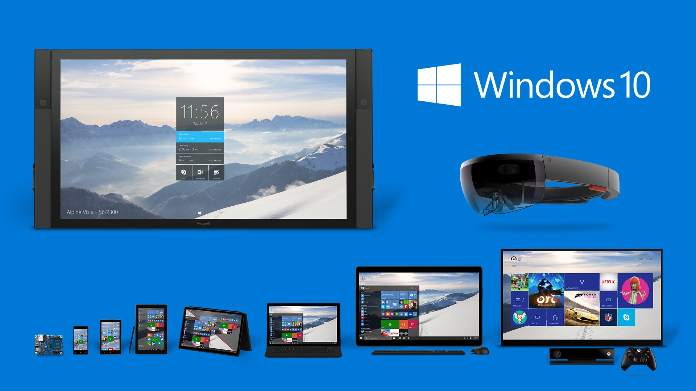

# Sveprisutna i prožimajuća računala

## Računala nisu samo osobna računala

Prilikom predstavljanja Microsoftove vizije za operacijske sutave iduće generacije 30. rujna 2014. godine, CEO Microsofta [Satya Nadella](https://news.microsoft.com/exec/satya-nadella/) je [izjavio sljedeće](https://techweez.com/2015/01/22/microsoft-windows-10/):

> Windows 10 is built for a world where everything in the world is digitally mediated. We want people to love Windows 10, by making Windows the home for a seamless delightful native experience for Microsoft experiences.

Marketinšku priču na stranu, autori operacijskih sustava današnjice razumiju da računalo nije samo osobno računalo i laptop, već i pametna televizija, igraća konzola, laptop s touch ekranom, tablet, mobiteli raznih veličina i ugradbena računala.

**Slika:** Windows 10 Product Family. (Slika preuzeta iz Techweezovog članka [Windows 10: A Bold New Direction For Microsoft](https://techweez.com/2015/01/22/microsoft-windows-10/).)

Pored ovih uređaja i računalne opreme za podatkovne centre, računala su i pametni kućanski aparati, ADSL modemi, pomoćni uređaji za ljude s poteškoćama, sustavi za klimatizaciju zgrada, automobili i drugi.
