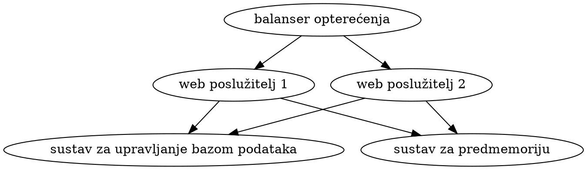

# Upravljanje dokumentacijom računalnih sustava i mreža

Kako sistemaš radi s mnogo različitih skupova usluga na stvarnim i virtualnim strojevima, često u više različitih konfiguracija, potrebno je održavati dokumentaciju koja opisuje specifičnosti instalacije i konfiguracije postojećih sustava.

## Tehnološka rješenja

Za održavanje dokumentacije mogu se koristiti programi za obradu teksta kao što su [LibreOffice Writer](https://www.libreoffice.org/discover/writer/) i [Microsoft Word](https://products.office.com/word). Kako takvi alati imaju vrlo složene i upitno prenosive formate za pohranu podataka, bolja je praksa koristiti [neki od wikija](https://en.wikipedia.org/wiki/List_of_wiki_software) ili [generatora statičkih web sjedišta](https://jamstack.org/generators/) zasnovanih na jednostavnim i svima čitljivim formatima označavanja običnog teksta. Primjerice, među wikijima je osobito popularan [DokuWiki](https://www.dokuwiki.org/) zato što ne zahtijeva korištenje sustava za upravljanje bazom podataka.

### Oblikovanje teksta

Bez obzira na wiki ili generator, tri se načina oblikovanja teksta vrlo često koriste:

- [Markdown](https://daringfireball.net/projects/markdown/), najčešće [varijanta koje je razvio GitHub](https://github.github.com/gfm/) za [pisanje prijava grešaka, komentara i drugog teksta](https://docs.github.com/en/github/writing-on-github), iako [postoje i druge](https://github.com/commonmark/commonmark-spec/wiki/Markdown-Flavors), među kojima je jedna od popularnijih [Python-Markdown](https://python-markdown.github.io/) korištena unutar sustava za izradu dokumentacije [MkDocs](https://www.mkdocs.org/),

    - Primjerice, MkDocs i [tema Material for MkDocs](https://squidfunk.github.io/mkdocs-material/) se koriste za proizvodnju [dokumentacije skupa proširenja PyMdown Extensions za Python-Markdown](https://facelessuser.github.io/pymdown-extensions/).

- [reStructuredText](https://docutils.sourceforge.io/rst.html), najčešće [proširenje koje nudi Sphinx](https://www.sphinx-doc.org/en/master/usage/restructuredtext/basics.html), popularni generator dokumentacije inicijalno namijenjen za [dokumentaciju programskog jezika Python](https://docs.python.org/), a kasnije uopćen,

    - Primjerice, Sphinx i [tema Read the Docs](https://sphinx-rtd-theme.readthedocs.io/) se koriste za proizvodnju [dokumentacije jezgre operacijskog sustava Linux](https://www.kernel.org/doc/html/latest/).

- [AsciiDoc](https://asciidoc.org/), danas najčešće korišten u putem generatora dokumentacije [Asciidoctor](https://asciidoctor.org/) i [Antora](https://antora.org/).

    - Primjerice, Asciidoctor se koristi za proizvodnju [dokumentacije operacijskog sustava FreeBSD](https://docs.freebsd.org/), a Antora za proizvodnju [dokumentacije operacijskog sustava Fedora Linux](https://docs.fedoraproject.org/).

Za rad s dokumentacijom koristit ćemo [Markdown](https://commonmark.org/help/) te online uređivač [HackMD](https://hackmd.io/) ili desktop uređivač [Visual Studio Code](https://code.visualstudio.com/).

### Crtanje dijagrama

[Graphviz](https://graphviz.org/) je softverski alat otvorenog koda za vizualizaciju grafova i može se koristiti za izradu [različitih vrsta dijagrama](https://graphviz.org/gallery/) koji prikazuju strukturu i način rada računalnih sustava i mreža. Grafovi se navode u obliku čistog teksta u [jeziku DOT](https://graphviz.org/doc/info/lang.html). Primjerice, graf koji opisuje infrastrukturu namijenjenu za izvođenje web aplikacije može biti oblika:



Više detalja o mogućnostima jezika nalazi se u [dijelu Attributes u službenoj dokumentaciji](https://graphviz.org/doc/info/attrs.html), a o načinu prikaza grafa u [dijelu Layout Engines](https://graphviz.org/docs/layouts/).

Spremimo li zapis grafa u datoteku `struktura-sustava.dot`, pretvorbu u SVG i PNG izvodimo naredbama:

``` shell
$ dot -Tsvg -o struktura-sustava.svg struktura-sustava.dot
$ dot -Tpng -o struktura-sustava.png struktura-sustava.dot
```

Više detalja o korištenju naredbenog retka moguće je pronaći u [dijelu Command Line u službenoj dokumentaciji](https://graphviz.org/doc/info/command.html), a o podržanim izlaznim formatima u [dijelu Output Formats](https://graphviz.org/docs/outputs/).

## Stilska pravila

Kod pisanja interne dokumentacije vrijedi slijediti nekoliko pravila.

- Nije potrebno pisati općenite informacije koje pišu u službenoj dokumentaciji softvera koji se koristi, npr. sve parametre pojedine naredbe ili sve dozvoljene vrijednosti neke varijable u konfiguracijskoj datoteci. Specifične informacije, npr. značenje konfiguracijske naredbe koja se koristi ili razlog za korištenje određene vrijednosti određenog parametra, svakako treba zapisati. Službena dokumentacija će vrlo vjerojatno biti dostupna tijekom čitavog životnog ciklusa softvera.
- Potrebno je zapisati upute za instalaciju i konfiguraciju preuzete s nekog foruma, bloga, društvene mreže, web sjedišta o tehnologiji ili sl. Moguće je da te stranice prestanu biti dostupne tijekom životnog ciklusa softvera.

    - Specifično, u slučaju da su upute dane u video formatu, dobro ih je prepisati u tekstualni za lakše kasnije pregledavanje.

- Dobra struktura dokumentacije je opis -- `naredbe` -- opis -- `naredbe` -- opis -- `sadržaj (dijela) konfiguracijske datoteke` -- ..., gdje se prvo navede što naredbe ili konfiguracija rade, a zatim ih se napiše kao `blok koda` da ih se kasnije može lakše pregledavati i kopirati.
- Zaporke se ne čuvaju u internoj dokumentaciji, već u specifičnim alatima kao što su [KeePassXC](https://keepassxc.org/), [KeePass](https://keepass.info/) i [Bitwarden](https://bitwarden.com/).
- Imena domaćina, IP adrese i slični podaci mogu se čuvati u internoj dokumentaciji, ali treba paziti da interna dokumentacija ostane interna. U slučaju da se dijelovi dokumentacije prerađuju za javnu objavu, imena i adrese treba zamijeniti generičkima.
- Promjene u tekstu treba čuvati u nekom sustavu za upravljanje verzijama.

## Dokumentiranje u vježbanju sistemašenja

(Napisano prema [4. epizodi podcasta 2.5 Admins nazvanoj Zooming from pets to cattle](https://2.5admins.com/2-5-admins-04/), 22. i 23. minuti gdje [Allan Jude](https://twitter.com/allanjude) govori kako postati sistemaš.)

Dokumentiranje je neizostavni dio učenja sistemašenja. Kad učite biti sistemaš, učite kroz rad (instalaciju operacijskih sustava, postavljanje određenih datotečnih sustava na određene medije za pohranu podataka, konfiguriranje određenih mrežnih usluga i sl.) i istovremeno dokumentirate što radite.

Kad ste gotovi, izbrišete sve što ste upravo postavili i po svojoj dokumentaciji ponovite postupak. Ako je postupak savršeno ponovljiv po dokumentaciji koju ste napisali bez da morate ručno razmišljati o dodatnim koracima koji ne pišu i gledati ostale izvore informacija, izvrsno. Ako nije, dopunite dokumentaciju i ponovite postupak.
