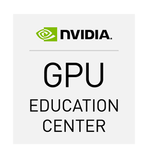

# Partnerstva i suradnje

## Obrazovni centar za grafičke procesore (GPU Education Center), bivši CUDA nastavni centar (CUDA Teaching Center)

> Do your science; let us handle your computation.

!!! note
    Naš status [Obrazovnog centra za grafičke procesore (bivšeg CUDA nastavnog centra)](https://developer.nvidia.com/higher-education-and-research) završio je 31. prosinca 2016. Ponosni smo što smo ostali u programu do njegovog samog kraja. Zahvaljujemo [NVIDIA](https://www.nvidia.com/)-i za svu pomoć i podršku! Nastavit ćemo podučavati [Paralelno programiranje na heterogenim sustavima](nastava/kolegiji/PPHS.md), koristiti [CUDA](https://developer.nvidia.com/cuda-zone)-u i [OpenCL](https://www.khronos.org/opencl/) (otvoreni standard za paralelno programiranje na heterogenim sustavima koji se sastoje od CPU-a, GPU-a, FPGA-a i potencijalno drugih vrsta čipova) u našem istraživanju te općenito promovirati računanje na grafičkim procesorima.

!!! warning
    Sadržaj u nastavku smatra se zastarjelim.

### Mogućnosti vizualnog računarstva razvijaju se impresivnim tempom

Računalne platforme su sve heterogenije, s računalnom snagom koja je podijeljena na CPU i GPU. Istodobno, tečajevi i radionice računalnog programiranja i znanstvenog računarstva suštinski se predaju na isti način kao prije dva desetljeća. Svakako, postoji prostor za napredak.

Godine 2012. osnovan je [CUDA nastavni centar](https://developer.nvidia.com/higher-education-and-research) na [Sveučilištu u Rijeci](https://uniri.hr/) u partnerstvu s [NVIDIA](https://www.nvidia.com/)-om. Naš cilj je pružiti platformu za edukaciju u domeni računanja na grafičkim procesorima koristeći CUDA-u. 2015. godine Centar je preimenovan u Obrazovni centar za grafičke procesore.

### Potražnja za računalnom snagom u mnogim granama znanosti i inženjerstva je sve veća

Računalna fizika, računalna kemija, primijenjena matematika, bioinformatika, medicinske slike, simulacija fluida, umjetna inteligencija, znanost o podacima. Mogli bismo nastaviti; svaki od njih i mnogi drugi ne bi imali ništa protiv samo malo dodatne računalne snage. Naš cilj je okupiti znanstvenike, inženjere i entuzijaste računarstva visokih performansi kako bismo zajedno radili na poboljšanju našeg razumijevanja prirodnih pojava i razvoju tehnologija sljedeće generacije.

### Računanje na grafičkim procesorima postaje uobičajeno i pronalazi primjene u industriji

Do sredine 2007. godine, neposredno prije nego što se CUDA pojavila, računanje na grafičkim procesorima je uglavnom bilo domena za hobiste. Kada je bilo primjenjivo, doista je nudilo impresivna ubrzanja izračuna. Međutim, programiranje grafičkih procesora bilo je teško i obično dostupno samo nišnim aplikacijama koje upravo odgovaraju tom programskom modelu. Danas, s mnogim lako dostupnim knjižnicama bogatim funkcijama, računanje na grafičkim procesorima je upotrebljivo uz trud u rasponu od promjene zaglavlja koja se uključuju i ponovnog prevođenja izvornog koda do restrukturiranja čitave aplikacije za veću paralelizaciju. Naravno, u svakom od koraka se mogu postići ubrzanja.

### Uloga je sveučilišta govoriti o napretku koji su omogućile nove tehnologije

Svijet je veliko i heterogeno mjesto. S više ljudi koji imaju pristup internetu i kvalitetnom obrazovanju, nove tehnologije se pojavljuju brže. Nijednoj organizaciji nije jednostavno usvojiti najnovija tehnološka dostignuća i istovremeno nastaviti pružati osnovnu uslugu na stabilan i predvidljiv način. S druge strane, svakodnevni posao računalnih znanstvenika je istraživanje, razvoj i dijeljenje informacija o računanju, odnosno govor o tehnologijama koje dobro funkcioniraju u određenim područjima.

### Podučavanje CUDA-e

Predajemo **Paralelno programiranje na heterogenim sustavima** koje se nudi na Odjelu za informatiku i izvodimo **Radionicu primjene grafičkih procesora** koja je otvorena za čitavo sveučilište:

- [Paralelno programiranje na heterogenim sustavima](nastava/kolegiji/PPHS.md) izborni je kolegij koji se nudi studentima treće godine preddiplomskog studija jednopredmetne informatike, a sastoji se od predavanja i praktičnih vježbi u računalnom laboratoriju opremljenom grafičkim procesorima.
- Radionica primjene grafičkih procesora sastoji se od praktičnih vježbi u računalnom laboratoriju opremljenom grafičkim procesorima. Izvodi se na godišnjoj bazi i otvorena je za svo sveučilišno osoblje. Studenti se također mogu prijaviti; ako ste zainteresirani, molimo vas da kontaktirate članove osoblja navedene u nastavku za više informacija. Sljedeća radionica održat će se u zgradi Sveučilišnih odjela u terminu koji će biti pravovremeno najavljen.

### Istraživanje u području heterogenog računarstva

Znanstvenici i inženjeri sa stručnošću u vlastitoj domeni mogu se usredotočiti na rješavanje problema iz te domene jer se mi brinemo o tehnikama računanja. Što je također ono što znanstvenici i inženjeri radije rade od toga da se brinu o tehnikama računanja. Aktivne suradnje su:

- **Sustav preporuka za aktivnosti e-učenja** (E-learning Activites Recommender Systemm, ELARS) je sustav obrazovnih preporuka koji predviđa sklonost učenika prema aktivnostima e-učenja. Optimizacija predviđanja preferencija se vrši pomoću CUDA-e. [Saznajte više.](https://fidit-rijeka.github.io/elarsportal/)
- **Fotonički WDM mrežni simulator** (Photonic WDM Network Simulator, PWNS) je proširenje mrežnog simulatora ns-3 koje pruža modele za komponente optičke mreže. Optimizacija usmjeravanja i dodjele valnih duljina vrši se pomoću CUDA-e. [Saznajte više.](istrazivanje-i-razvoj.md#fotonicki-wdm-mrezni-simulator-photonic-wdm-network-simulator-pwns).
- Metilacija DNA temeljni je mehanizam u funkcionalnoj organizaciji ljudskog genoma. Koristeći NVIDIA GPU s omogućenom CUDA-om i softverom za računalnu kemiju otvorenog koda, razvija se *in-silico* **skup potencijalnih inhibitora ljudske DNA metiltransferaze Dnmt1**. [Saznajte više.](https://svedruziclab.github.io/research.html#the-development-of-mechanism-based-inhibitors-of-human-dna-methyltransferase-dnmt1)
- Korištenjem grafičkih procesora također je moguće ubrzati **mapiranje okoline od strane mobilnog robota koji posjeduje 3D senzor**. [Saznajte više.](https://apaslab.riteh.hr/projects/)
- **Vaš projekt!** Imate li ideju za istraživački projekt ili imate projekt koji je u tijeku? Mislite da biste ga potencijalno mogli ubrzati ili imati neku drugu korist od računanja na grafičkim procesorima? Željeli bismo čuti o tome; stupite u kontakt s članovima osoblja navedenim u nastavku.

### Savjetovanje

Računanje na grafičkim procesorima i CUDA proširili su svoj doseg izvan znanstvenih laboratorija i ušli u industrijske primjene. A ovo je tek početak.

Razmišljate li o ulaganju u heterogene sustave s CPU-ima i GPU-ima, ali niste sigurni hoće li oni dobro funkcionirati na vašoj aplikaciji? Ili možda uspoređujete sustave samo s CPU-ima sa sustavima s CPU-ima i GPU-ima u terminima performansi, cijene i energetske učinkovitosti? Možemo vam pomoći u odabiru komponenata.

### Promotivne aktivnosti

Uživamo pričati o računanju široj publici. Organizirate li događaj usmjeren na širu publiku koji ima veze s računanjem na grafičkim procesorima ili superračunalima? Možda bismo bili zainteresirani za sudjelovanje.

### Osoblje

Mi smo interdisciplinarni tim koji čine profesori, docenti, poslijedoktorandi i asistenti sa Sveučilišta u Rijeci koji rade u različitim područjima znanosti i tehnike.

- [dr. sc. Vedran Miletić](https://vedran.miletic.net/), Odjel za informatiku i Tehnički fakultet Sveučilišta u Rijeci
- [doc. dr. sc. Božidar Kovačić](https://portal.uniri.hr/Portfelj/1506), Odjel za informatiku Sveučilišta u Rijeci
- [doc. dr. sc. Željko Svedružić](https://svedruziclab.github.io/principal-investigator.html), Odjel za biotehnologiju i Medicinski fakultet Sveučilišta u Rijeci
- [izv. prof. dr. Kristijan Lenac](https://klenac.weebly.com/), Tehnički fakultet Sveučilišta u Rijeci
- [Luka Vretenar](https://luka.vretenar.pro/), [Enliteon](http://www.enliteon.com/) (ranije Odjel za informatiku i Tehnički fakultet Sveučilišta u Rijeci)
