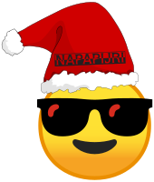

# Otvoreni kod u mozaiku otvorene znanosti

## Vedran Miletić, Fakultet informatike i digitalnih tehnologija

### Mutimir 2022 (Udruga Penkala), Hotel Matija Gubec, 28. prosinca 2022.

---

## Predstavljanje predavača

* Docent, [Fakultet informatike i digitalnih tehnologija](https://www.inf.uniri.hr/), Sveučilište u Rijeci
    * Voditelj Grupe za aplikacije i usluge na ekaskalarnoj istraživačkoj infrastrukturi (engl. **G**roup for **A**pplications and **S**ervices on **E**xascale **R**esearch **I**nfrastructure)
* Računarstvo (formalno), računalna biokemija (realno)
    * Razvoj istraživačkog softvera za superračunala i računalne oblake
    * Fokus: simulacija molekulske dinamike biomolekula

---

## Otvorena znanost

---

## Mentimeter: Što je za vas otvoreni kod / slobodni softver?

### Posjetite `www.menti.com` i upišite kod `1866 0700`

---

## Crtice iz povijesti

* Richard Stallman, FSF i GNU, 1983.
    * slobodni softver (engl. *free software*)
* Netscape/Mozilla 1998., preteča Firefoxa
    * kontekst: [dot-com boom](https://en.wikipedia.org/wiki/Dot-com_bubble), počeci bogatih web aplikacija (web 2.0)
    * otvoreni kod (engl. *open source*)
    * posljedica: Google Chrome, [Microsoft is dead](http://www.paulgraham.com/microsoft.html)

---

## Tradicionalni tzv. akademski pristup licenciranju softvera

* akademska primjena bez naknade
* komercijalna primjena zahtijeva posebnu licencu
* pristup izvornom kod dozvoljen suradnicima na projektima

---

## Stanje znanstvenog softvera (1/2)

* [List of protein-ligand docking software](https://en.wikipedia.org/wiki/List_of_protein-ligand_docking_software)
* [List of quantum chemistry and solid-state physics software](https://en.wikipedia.org/wiki/List_of_quantum_chemistry_and_solid-state_physics_software)
* [List of systems biology modeling software](https://en.wikipedia.org/wiki/List_of_systems_biology_modeling_software)
* [List of bioinformatics software](https://en.wikipedia.org/wiki/List_of_bioinformatics_software)
* [List of free geology software](https://en.wikipedia.org/wiki/List_of_free_geology_software)

---

## Stanje znanstvenog softvera (2/2)

* Python/Jupyter, R, Julia
* program-prevoditelji i biblioteke za [Fortran](https://fortran-lang.org/), C, [C++](https://en.cppreference.com/w/cpp/links/libs) i [Rust](https://www.rust-lang.org/)
* [Comparison of deep learning software](https://en.wikipedia.org/wiki/Comparison_of_deep_learning_software)
* Još primjera?

---

## *Everything as a Service*

* aplikacije i usluge dostupne u oblaku (GMail, [Adobe CC](https://www.adobe.com/creativecloud.html), [Overleaf](https://www.overleaf.com/), Office 365, [Figma](https://www.figma.com/), [BioRender](https://biorender.com/) itd.)
* tzv. *web serveri* u znanosti: [Charmm-gui](https://charmm-gui.org/), [SwissParam](https://www.swissparam.ch/), [HADDOCK](https://wenmr.science.uu.nl/haddock2.4/), [webSDA](https://websda.h-its.org/webSDA) itd.
* sadašnjost i budućnost znanosti: [ELIXIR Services](https://elixir-europe.org/services)
* programski kod usluge i pripadna dokumentacija mogu biti otvoreni, svatko može pokrenuti svoju instancu aplikacije ili usluge
    * mogućnost federacije, npr. kao [Mastodon](https://joinmastodon.org/)
    * mogućnost dobrovoljnog računanja, npr. kao [Folding@home](https://foldingathome.org/)

---

## Načela slobodnog softvera otvorenog koda i prednost u otvorenoj znanosti

* > The freedom to run the program, for any purpose.
    * reproducibilnost znanstvenog procesa
* > The freedom to study how the program works, and change it so it does your computing as you wish.
    * istraživački rad
* > The freedom to redistribute copies so you can help your neighbor.
    * suradnja
* > The freedom to distribute copies of your modified versions, giving the community a chance to benefit from your changes.
    * objava rezultata

---

## Zaključak

* Doba licenciranja softvera po *defaultu* kao slobodnog softvera otvorenog koda nije privremena povijesna epizoda; ono je epoha
    * [Tracking the explosive growth of open-source software](https://techcrunch.com/2017/04/07/tracking-the-explosive-growth-of-open-source-software/)
    * [Open Source is Taking Over Europe!](https://itsfoss.com/open-source-adoption-europe/)
    * [Open Source Survey](https://opensourcesurvey.org/2017/)
* Doba besplatnog tzv. akademskog softvera je završilo 2000-ih omasovljenjem korištenja interneta i dolaskom Weba 2.0
    * [What is the price of open-source fear, uncertainty, and doubt?](https://gaseri.org/en/blog/2015-09-14-what-is-the-price-of-open-source-fear-uncertainty-and-doubt/)
