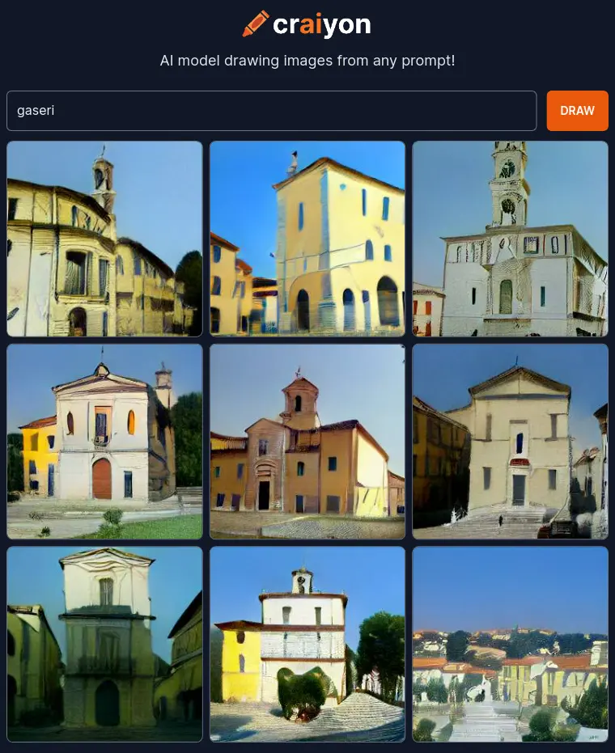

# Vrlo važne informacije

(Ova je stranica također dostupna [na engleskom jeziku](../en/very-important-information.md).)

## Identitet

### Logotip

[Preuzimanje GASERI logotipa u vektorskom formatu SVG](../images/gaseri-logo.svg)

[Preuzimanje GASERI logotipa s tekstom u vektorskom formatu SVG](../images/gaseri-logo-text.svg)

[Preuzimanje GASERI postera u vektorskom formatu SVG](../images/gaseri-poster.svg)

Za druge sheme boja i sezonske logotipe pregledajte [direktorij `docs/images` u repozitoriju našeg web sjedišta na GitHubu](https://github.com/gaseri/website/tree/main/docs/images).

### Himna

\[Pred-Refren\]  
Oni sve bi dali (Oni sve bi dali, oni sve bi dali, oni sve bi dali)  
Da vide da smo pali (Da smo pali)  
Samo gazi, gazi, gazi

\[Refren\]  
Skupi kao PSG, ovi ostali su žasu  
Zadnja vuča - BMW, ovi moji svi u gasu  
Oko mene moji ljudi, po-podižemo masu  
Na nastupu odvaljen, bato, opet skidam masku

Izvori: [Đ-SHOCK - PSG (Official Music Video) - YouTube](https://youtu.be/MxLrxXu10YY), [Đ-Shock (SRB) – PSG Lyrics | Genius](https://genius.com/Shock-srb-psg-lyrics)

## Često postavljana pitanja

### Na kojem je zavodu Laboratorij za računalne mreže, paralelizaciju i simulaciju?

Na [Zavodu (rus. Заводу) 311](https://battlefield.fandom.com/wiki/Zavod#Zavod_311).

### Завод 311? Znači li to da su vas ruski hakeri haknuli?

Нет.

(Stranice laboratorija servira [Apache](https://httpd.apache.org/), a ne [nginx](https://nginx.org/); ako vam se to čini kao [sasvim proizvoljan odabir jer, eto, mi zasad nismo Google](https://news.ycombinator.com/item?id=14588024), dobro je podsjetiti se da je inicijalni autor nginxa (bolje rečeno, [нгинкса](https://nginx.org/ru/)) poznati ruski haker [Igor](https://youtu.be/YWRYbLKsS0I) [Vladimirovich](https://youtu.be/j9VSQ8UaBnY) [Sysoev](http://sysoev.ru/en/).)

### Zašto CNPSLab nije naveden na [popisu laboratorija FIDIT-a](https://www.inf.uniri.hr/znanstveni-i-strucni-rad/laboratoriji)?

Laboratorij je [ukinut promjenom unutarnjeg ustroja](../hr/index.md#povijest) prilikom [promjene naziva Odjela za infromatiku u Fakultet informatike i digitalnih tehnologija](https://www.inf.uniri.hr/11-hr/naslovnica/915-odjel-za-informatiku-postaje-fakultet-informatike-i-digitalnih-tehnologija).

### Zašto GASERI nisu navedeni na [popisu laboratorija FIDIT-a](https://www.inf.uniri.hr/znanstveni-i-strucni-rad/laboratoriji)?

Mi smo Grupa za aplikacije i usluge na eksaskalarnoj istraživačkoj infrastrukturi (GASERI), a ne Laboratorij za aplikacije i usluge na eksaskalarnoj istraživačkoj infrastrukturi (LASERI).

### Koliko su GASERI jaka institucija?

Druga su najjača institucija na Balkanu, odmah nakon [unuka Bake Praseta](https://youtu.be/8SsrKd_o010).

Iznimka je [kraj rujna, čitav listopad i početak studenog 2022. godine](https://www.index.hr/magazin/clanak/baki-prasetu-vracen-youtube-kanal-s-preko-dva-milijuna-pratitelja/2409371.aspx) dok je [Baki Prasetu bio ugašen kanal](https://n1info.hr/showbiz/baki-prasetu-ugasen-youtube-kanal-s-vise-od-2-milijuna-pratitelja/) i njegovi su unuci bili nešto slabije organizirani pa su tada GASERI bili najjača institucija na Balkanu.

### Može li si ozbiljna institucija dozvoliti da ima emoji kao logo?

Razmotrimo tvrtku [Hugging Face](https://huggingface.co/), autore [Transformersa](https://huggingface.co/transformers), skupa predtreniranih modela za strojno učenje koji ima [68 tisuća zvjezdica na GitHubu](https://github.com/huggingface/transformers). Dosad su [primili 160 milijuna dolara investicija](https://www.crunchbase.com/organization/hugging-face), [procijenjena vrijednost tvrtke iznosi 2 milijarde dolara](https://www.forbes.com/sites/kenrickcai/2022/05/09/the-2-billion-emoji-hugging-face-wants-to-be-launchpad-for-a-machine-learning-revolution/), a njihovo web sjedište ima [19.4 milijuna pogleda mjesečno](https://www.similarweb.com/website/huggingface.co/).

Naravno, mi imamo emoji [Smiling Face with Sunglasses (Cool) 😎](https://emojipedia.org/smiling-face-with-sunglasses/) kao svoj logo prije svega zato što to i jesmo.

### Kako izgleda sastanak grupe?

😎💬😎💬... 😎🤝😎.

### Kada ćete objaviti određeni znanstveni rad/programski kod/skup podataka/audiovizualni uradak?

Uskoro, stvari se rješavaju.

### Bojite li se `du -ha`?

Ne bojimo se `du -ha` jer imamo oštrog `ps -a`; ako to ne bude dovoljno, uzet ćemo `top` u ruke i napraviti `killall`.

### Što se petkom navečer radi u Terminalu?

[Terminal](https://www.facebook.com/terminal.club) je daleko pa se nađemo u [GNOME Terminalu](https://wiki.gnome.org/Apps/Terminal) i popravljamo [imenovane cijevi](https://thorstenball.com/blog/2013/08/11/named-pipes/).

### Što je prvi hrvatski predsjednik dr. Franjo Tuđman rekao o prijetnjama slobodi softvera otvorenog koda?

U svom [poznatom govoru](https://hr.wikisource.org/wiki/Govor_Franje_Tu%C4%91mana_u_Zra%C4%8Dnoj_luci_Zagreb_23._studenog_1996.) u [Zračnoj luci Zagreb](https://www.openstreetmap.org/way/142163337) 23. studenog 1996. godine, [dr. Franjo Tuđman](https://hr.wikipedia.org/wiki/Franjo_Tu%C4%91man) je rekao:

> Mi nećemo dopustiti [ostacima vlasničkih Unixa](https://en.wikipedia.org/wiki/Santa_Cruz_Operation), niti Microsofta, stanje kakvo smo bili zatekli u računarstvu uspostavom slobode softvera i otvorenog koda. Nećemo dopustiti da nam sve to dovedu u pitanje. Nećemo to dopustiti tim ostacima vlasničkih Unixa, ali ni onim tehnološkim redikulima, bezglavim smušenjacima koji ne vide o čemu se zapravo radi danas u slobodnom softveru i u svijetu sa kojekakvim GitHub projektima... Nećemo dopustiti onima koji se vežu i s [raznobojnim vragom](https://www.microsoft.com/) protiv slobode softvera i otvorenog koda, ne samo s raznobojnim, nego i [crvenim](https://www.oracle.com/) i [crnobijelim](https://www.apple.com/) vragovima... Nećemo dopustiti onim koji se povezuju sa svima protivnicima slobodnog softvera, ne samo povezuju nego im se nude, ne samo da im se nude nego im se prodaju za [Secure Boot](https://arstechnica.com/information-technology/2015/03/windows-10-to-make-the-secure-boot-alt-os-lock-out-a-reality/), [DRM](https://www.defectivebydesign.org/) i [softverske patente](https://www.eff.org/press/releases/eff-outlines-plan-fix-broken-patent-system), kao što se i sami hvale da dobivaju tehnologiju iz svih laboratorija svijeta, a povezuju se od ekstremista zatvorenosti, do kojekakvih lažnih hipstera, pseudootvorenih obmanjivača koji nam danas propovijedaju velike ideje o pravima korisnika i otvorenim standardima.
>
> Da! [Mi smo stvarali svoju slobodu za prava korisnika i za otvorene standarde](https://www.w3.org/blog/2008/11/w3c-open-web-standards/), ali za prava korisnika prije svega većine korisnika slobodnog softvera. Ali ćemo, razumije se, mi sa tom slobodom softvera i otvorenim kodom osigurati i korisnicima neslobodnog softvera ta prava i otvorene standarde. [Ali nećemo dopustiti da nam ti sa strane rješavaju, odnosno nameću rješenja.](https://www.computerworld.com/article/2543739/microsoft-guns-open-xml-onto-iso-fast-track.html) Slobodan softver neće biti pod kontrolom nijedne kompanije. Unix je dosta bio i pod Berkeleyem i pod AT&T-em, i pod Sunom i pod IBM-om, i pod SGI-em. Zajednica oko Linuxa je izborila svoju slobodu, svoju samostalnost, svoje pravo da sama odlučuje o svojoj sudbini.

### Kako se zovu predstavnici novih generacija okrenuti exaskalarnim superračunalima i isključivo firmiranom hardveru?

<blockquote class="tiktok-embed" cite="https://www.tiktok.com/@nikola_replay/video/7090912972452711686" data-video-id="7090912972452711686" style="max-width: 605px;min-width: 325px;" > <section> <a target="_blank" title="@nikola_replay" href="https://www.tiktok.com/@nikola_replay">@nikola_replay</a> 🤣 <a title="foryou" target="_blank" href="https://www.tiktok.com/tag/foryou">#foryou</a> <a title="foryoupage" target="_blank" href="https://www.tiktok.com/tag/foryoupage">#foryoupage</a> <a target="_blank" title="♬ original sound - @nikola_replay" href="https://www.tiktok.com/music/original-sound-7090912949518338821">♬ original sound - @nikola_replay</a> </section> </blockquote> 

### Ima li Grupa za aplikacije i usluge na eksaskalarnoj istraživačkoj infrastrukturi više teleskopa nego Ruđer Bošković?

Naravno da nema, jedino [Bore Balboa](https://youtu.be/x9x0oAcjFNA?t=42s) ima [u kući više teleskopa nego Ruđer Bošković](https://genius.com/23445076).

### Jesu li GASERI u ontološko-fenomenološkom smislu tradicionalni ili moderni?

Oko ovog pitanja u [javnom](https://sh.wikipedia.org/wiki/Dizela%C5%A1i) [diskursu](https://vukajlija.com/gaser) postoje [stanovita](https://www.instagram.com/prosecni.gaser/) [neslaganja](https://znatko.com/17071/tko-je-gaser) pa smo odlučili prepustiti [umjetnoj inteligenciji Craiyon](https://www.craiyon.com/) (ranije poznatoj pod imenom [DALL-E mini](https://github.com/borisdayma/dalle-mini)) da na njega odgovori.

[Slika govori](https://en.wiktionary.org/wiki/a_picture_paints_a_thousand_words) [više nego](https://www.croexpress.eu/hrvatske-narodne-izreke-odabrali-smo-vise-od-60-najzanimljivijih/) [tisuću riječi](https://en.wikipedia.org/wiki/A_picture_is_worth_a_thousand_words) pa je u ovih [više od 9000](https://knowyourmeme.com/memes/its-over-9000) riječi Craiyon jasno svima dao do znanja da su gaseri sastavni dio višestoljetne tradicije.

### Nudite li pristup vašim poslužiteljima putem SSH?

GASERI ne nude pristup putem [SSH](https://www.openssh.com/), već samo putem [SSHH..](https://youtu.be/Fs96WfdspEk)

### Sponzorira li vas [Caterpillar](https://www.caterpillar.com/)?

Trenutno ne, ali smo uvijek otvoreni za suradnju. Primjerice, dobro bi nam došao [viličar](https://www.caterpillar.com/en/brands/cat-lift-trucks.html) za furati servere od laboratorija do podatkovnog centra i nazad.

## Mnogo više od deset primjera kako se (ne) ulizivati VM

Verzija iz akademske godine 2009/2010. uz sitnije stilske ispravke; bonus primjeri su iz kasnijih godina. Napisano prema istinitim događajima, ali prilagođeno po potrebi.

### Primjer 1

!!! bug
    "Profesore, znate, probao sam ATI Catalyst 10.2 na Windowsima 7... jel' mi možete objasniti zašto Call of Duty 6 ima corruptane teksture?"

!!! tip
    "Profesore, znate da KMS radi na novoj Fedori 13 na mom laptopu koji ima ATI RS690M, čak imam i 3D akceleraciju i pored toga mi Wine dosta solidno radi, probao sam Diablo II preko D3D-a i WarCraft III preko OpenGL-a, oba rade. Doduše, naletio sam na jedan sitniji bug vezan uz DDX u jednoj manje poznatoj aplikaciji koji se događa samo kad je KMS uključen, provjerio sam, i to sam odmah prijavio. Imate li sugestiju koju bih još aplikaciju mogao testirati pod Wineom?"

### Primjer 2

!!! bug
    "Profesore, jeste li u Wordu 2007..."

!!! tip
    "Profesore, znate da kad u TeX-u koristite memoir klasu sa beamerarticlom ne radi kompajliranje dokumenta, ali sam pokušala popraviti i nisam točno sigurna kako točno makroi `\catcode 14` i `\Hy@beamersection` ne rade skupa. Možemo li to zajedno pogledati?"

### Primjer 3

!!! bug
    "Ovo \[Računalne mreže 1\] i Kombinatorika su nam najteži predmeti."

!!! tip
    "Ovo \[Računalne mreže 1\] i Kombinatorika su nam najizazovniji predmeti. Kako nam je drago što imamo predmete na kojima možemo tako puno naučiti. Mislim, što će nam trivijalni predmeti?"

### Primjer 4

!!! bug
    "Profesore, zašto moramo zadaće pisati na posebnom obrascu?"

!!! tip
    "Profesore, smijem li zadaću iz računalnih mreža pisati u (La)TeX-u?"

### Primjer 5

!!! bug
    "Zašto moramo toliko zadaća i kolokvija imati?"

!!! tip
    "Zašto nemamo pored svega što već radimo na Računalnim mrežama nemamo i neki projekt, čisto da vidimo primjenu tih znanja u programiranju, tako da timski kodiramo složenu mrežnu aplikaciju koju ćemo kasnije izbaciti pod nekom open source licencom?"

### Primjer 6

!!! bug
    "Profesore, znate kako dobro C# radi XY..."

!!! tip
    "Profesore, kodirala sam u Pythonu Monte Carlo simulaciju kvarova u mreži za mrežne topologije reda veličine 10^3 čvorova, mogu vam poslati kod, i moram vam priznati da mi se jako sviđa NetworkX i NumPy, pa sam razmišljala ako biste bili zainteresirani da vam iskodiram konverter NetworkX grafova u SORM notaciju, a pritom bi usput mogala napraviti i generator LaTeX tablica iz rezultata koje dobijem."

### Primjer 7

!!! bug
    "Profesore, biste li napisali postupak kako se instalira Oracle XE na Windowsima?"

!!! tip
    "Profesore, upravo pišem upute kako se instalira Oracle XE na Windowsima, i napravio sam screenshotove. Biste li bili voljni, znam da imate puno posla, da dopunite sa uputama za instalaciju na Linuxu da to objavimo kao kompletne upute na webu?"

### Primjer 8

!!! bug
    "Profesore, jel mi možete odgoditi..."

!!! tip
    "Profesore, znate nisam stigla pa ću jednostavno izgubiti bodove jer to i zaslužujem. Nemojte se brinuti, znam da sam ja kriva."

### Primjer 9

!!! bug
    "Profesore, zašto se od nas očekuje da aktivno radimo na slobodnom softveru?"

!!! tip
    "Profesore, ja razumijem zašto trebamo raditi na slobodnom softveru i svakako to želim. Međutim, ovaj GNOME mi je nekako previše korisnički orijentiran i suviše jednostavan. Ja smatram da su računala stvar za ljude koji razumiju računarstvo. Znate onaj biblatex koji je aktualna stvar u TeX zajednici i predstavlja veliki napredak u odnosu na bibtex, ja znam da bi ga vi sigurno preveli na hrvatski jezik bolje od mene, ali čisto da vas rasteretim, što kažete da to ja prevedem? Ne za bodove, nego za gušt i da pridonesem slobodnom softveru."

### Primjer 10

!!! bug
    "Joj da znate kako je nama teško ovo ono..."

!!! tip
    "Profesore, kako vam je na FER-u? Jedva čekam da doktorirate. Biste li nam pričali o temama kojima se bavite na doktoratu?"

### Bonus primjer 1

!!! bug
    "Zašto moramo učiti kako raditi u Emacsu?"

!!! tip
    "Profesore, Googlala sam malo korištenje Emacsa, pa možete li mi reći do kuda vrijedi čitati GNU-ove priručnike za Emacs i Emacs Lisp? Možete li mi preporučiti neku drugu knjigu koja obrađuje napredno korištenje Emacsa, uključujući i programiranje u Elispu? Želim biti vješta u korištenju uređivača teksta, a znam i da će mi dobro doći da proširim znanje funkcijskih jezika."

### Bonus primjer 2

!!! bug
    "Profesore, radi li MPI for Python na Windowsima?"

!!! tip
    "Profesore, svjestan sam da gotovo nikog nije briga radi li MPI (for Python) na Windowsima obzirom da je preko 90% od 500 najjačih superračunala na svijetu pogonjeno Linuxom. Možda bih mogao i ja početi koristiti Linux za razvoj softvera, ma zapravo za sve osim igranja igara na Battle.net-u."

### Bonus primjer 3

!!! bug
    "Profesore, znate kako sam puno napravila tijekom preddiplomskog studija, ovdje je moj projekt za završni rad od 120 linija koda."

!!! tip
    "Profesore, dok sam bila u srednjoj školi sam u slobodno vrijeme napravila samo jednu mobilnu aplikaciju, možete je pronaći na Google Playu. Mislim se sada za vrijeme studija više aktivirati. Imate li sugestiju na čemu mogu raditi i/ili kojim projektima otvorenog koda mogu doprinijeti?"

### Bonus primjer 4

!!! bug
    "Joj, baš mi se ne da ništa učiti, radije bih gledao zezancije i e-celebe na Instagramu."

!!! tip
    "Profesore, znate, iako mi se ponekad ne da ništa raditi i radije bih gledao kojekakve bedastoće na Instagramu, jasno mi je da su moji preci preživjeli zato što su bili disciplinirani i razvijali tehnologiju koja omogućuje našoj civilizaciji da funkcionira na ovoj razini blagostanja. Baš zato želim biti dio tog povijesnog kontinuiteta i razvoju tehnologije dati svoj doprinos."

### Bonus primjer 5

!!! bug
    "Kolega, ja mislim da bi ti trebao koristiti neslobodan softver Microsoft Office umjesto slobodnog softvera LibreOffice."

!!! tip
    "Kolega, ja razumijem da ne možeš baš uvijek i svugdje koristiti slobodan softver, ali izrazito cijenim što pokušavaš i smatram da bi \[na Paralelnom programiranju na heterogenim sustavima i u znanstvenom radu\] trebao umjesto NVIDIA-ine vlasničke tehnologije CUDA koristiti otvoreni standard OpenCL na AMD-ovoj implementaciji otvorenog koda ili Intelovom Beignetu."

### Bonus primjer 6

!!! bug
    "Profesore, jučer sam do 3 ujutro igrao Battlefield 4 u multiplayeru."

!!! tip
    "Profesore, jučer sam namjeravao do 3 ujutro igrati Battlefield 4 u multiplayeru, ali za vrijeme igranja sam se zamislio kako ta igra zapravo radi i shvatio da je ona jedinstvena sinteza rada eksperata iz mnogih područja računarstva pa sam skratio malo igranje i umjesto toga izučavao po DICE-ovim prezentacijama i radovima kako radi \[Battlefieldov game engine\] Frostbite. Zakon mi je što su sve te informacije učinili dostupnim putem svojih mrežnih stranica."

### Bonus primjer 7

!!! bug
    "Profesore, zašto moramo učiti Emacs? Ja bih radije da učimo Vim."

!!! tip
    "Profesore, ja bih rado da učimo Vim [na Operacijskim sustavima 1], ali vrijeme na kolegiju je ograničeno i očito se ne može stići sve obraditi. Zbog toga ću, za one studente koje Vim zanima, održati dodatne radionice neovisno o vašim vježbama. Možete li mi pronaći termin u rasporedu u kojem bi to mogli izvesti?"

### Bonus primjer 8

!!! bug
    "Profesore, puno je ljudi odgovorilo d) u 6. pitanju, a vi tvrdite da je točno b), pa ja mislim da je zapravo točno i d) zbog toga što je puno ljudi odgovorilo d) te biste vi trebali priznati i d) kao točno."

!!! tip
    "Profesore, puno je ljudi odgovorilo d) u 6. pitanju, međutim, tvrditi da je zbog toga d) točan odgovor je *argumentum ad populum*, a svi dobro znamo da je to jedna od čestih zabluda u argumentiranju."

### Bonus primjer 9

!!! bug
    "Profesore, zašto bi me u doba kad veza na internet radi na dva klika mišem ili dodira po ekranu zanimalo kako se konfiguriraju te podmreže, adrese i maske?"

!!! tip
    "Profesore, moram vam reći da sam se na poslu nedavno cijeli dan držao za glavu jer nisam pratio kad se predavalo o CIDR-u i blokovima adresa."

### Bonus primjer 10

!!! bug
    "Profesore, ja stvarno ne znam kako su drugi prepisali od mene."

!!! tip
    "Profesore, ja znam kako su drugi prepisali od mene i prihvaćam krivnju za to. Pošaljite nas svih na stegovno povjerenstvo jer prepisivanje nije u redu."

## Proza

### Legenda o nastanku **S**tandarda **O**značavanja **R**ačunalnih **M**reža

Prema zapisima povjesničara Emilijana Pesara, koji je živio u doba vladavine mletačkog dužda Domenica II Contarinija, **SORM** potječe od perzijskih spisa koje je Marko Polo pronašao za vrijeme putovanja Kinom i sa sobom donio u Veneciju. Kako bi ih zaštitio od inkvizicije, sakrio ih je među svoje osobne bilješke s putovanja po kineskim južnim i istočnim provincijama. Te su bilješke zajedno s umetnutim perzijskim spisima njegovi otac i ujak prodali trgovcima sitnom robom za vrijeme dok je bio u tamnici, zbog čega je Marko bio primoran svoju priču ispričati Rustichelliju iz Pise po sjećanju.

Jedan od vojskovođa mletačkog dužda, Michele Valiero, priča kako je na štandu u Veneciji uočio nekakve spise na neobičnom materijalu sličnom papiru, ali bitno različitom od svega što je bilo poznato u Europi. Želeći istražiti o čemu se radi, od trgovca je, bez puno premišljanja, otkupio sve što je ovaj imao.

Proučavajući spise, vojskovođa je shvatio da bi otkrivanje ovih drevnih istina moglo imati katastrofalne posljedice i uzrokovati pomicanje kraja svijeta na raniji datum, te ih je u kasnijem osvajačkom pohodu na Starigrad Paklenicu zakopao ispod Večke kule.

Stoljećima kasnije, mladi asistent sa Zavoda za komunikacijske sustave Odjela za informatiku Sveučilišta u Rijeci jedne se večeri šetao laganim koracima uz obalu, osluškujući živu glazbu koja je dopirala s terase obližnjeg hotela.

Našavši se blizu Večke kule, osjetio je energetsku auru crveno-plave boje i potrčao prema mjestu gdje ju je najjače osjećao. Iznenada je počeo mahnito kopati. Na metar i pol ispod zemlje naišao na ukrašenu metalnu škrinju.

Škrinja je na poklopcu imala ugraviranog lava s ptičjim krilima, koji je desnom šapom držao otvorenu knjigu na kojoj je pisalo:

> PAX TIBI MARCE EVANGELISTA MEVS.

Mladi asistent je osjetio da će ovo što je pronašao iz temelja promijeniti živote svih ljudi koje poznaje i koje će tek upoznati. Snažno je proživljavao svaku sekundu koju je potiho otkucavao njegov ručni sat dok je bezuspješno pokušavao naći način da otvori lokot kojim je škrinja bila zatvorena.

Napokon je obio lokot kamenom grotom s plaže, podigao poklopac i njime nehotice ogrebao desno staklo na naočalama.

Vojskovođa je zapisao:

> Tajne perzijske tehnike crtanja dijagrama iz Računalnih mreža zapisane na ovim papirima dio su knjige *Matematičko modeliranje računalnih mreža* koju je napisao Datafarnah. U ovih dvije godine uspio sam otkriti značenje većine spisa, i postao sam svjestan kakav bi utjecaj mogli oni imati ako dođu u krive ruke.
>
> Bojim se, najviše od svega, proročanstva koje opisuje što bi se dogodilo da netko neuk napiše **SORM** malim slovima, zakošeno ili običnim oblikom pisma. Zato **SORM** uvijek piši masnim uspravnim oblikom pisma, velikim slovima.

Mladi se asistent na trenutak zamislio. Osjetio je da je ovo prilika koja se rijetkima pruža i koju još rjeđi znaju cijeniti, ali tada još nije imao čistu viziju što treba napraviti.

Mjesecima kasnije, krećući se laganim koracima kroz snijegom obasuti Karlovac, razmišljao je o svemu što je doživio tog ljeta. U putničkom vlaku na relaciji Karlovac–Zagreb, napokon je shvatio dubinu koju imaju
Micheleove riječi i osjetio pravo značenje svog poziva.

### Legenda o nastanku laboratorijskih vježbi iz Računalnih mreža

Rustichelli iz Pise čuo je od Marka Pola za vrijeme dok su obojica bili zarobljeni u tamnici brojne priče o putovanjima Kini. Jedna od njih govorila je kako su na putu prema Kini Markov otac i ujak dobili na poklon od svećenika u Kašgaru svilu koja je na sebi imala naslikane neobične dijagrame, za razliku od ostale svile koja je uglavnom bila oslikana motivima iz prirode.

Gotovo dvadeset godina kasnije, na povratku, Markov su otac i ujak pokušavali odgonetnuti značenje dijagrama na svili, i svoje rezultate zapisivali na spisima koje su čuvali u kući u Veneciji. Marko Polo ponio je svile i spise sa sobom na Korčulu; svile su mu otete kada je zarobljen od strane đenovljanskih vojnika u bitci s Mlecima, a spisi su ostali u njegovoj kući na Korčuli jer su smatrani bezvrijednima.

Rustichelli kaže da, iako je Marko znao za te svile i spise, izgleda da nije bio svjestan vrijednosti onog što je bilo na njima jer ih je tek u nekoliko navrata usputno spomenuo. Upravitelj zatvora, Enrico Lenafesto, saznavši za to, bio je odlučan u namjeri da spise pronađe i detaljno pregleda.

Predstavivši se kao brat tadašnje Markove zaručnice Donate Badoer, Enrico je u prvi mah pušten u kuću bez prevelikog propitivanja od strane Korčulanaca. U kući je pronašao čitavu škrinju punu spisa; većina njih bila je neuredna i s puno pogrešaka, ali ubrzo ih je pregledao i uspio poredati. Zaključio je da su autori spisa odgonetnuli i detaljno opisali značenja dijagrama na svili. Uspoređujući spise i slike na svili, došao je do zapanjujućih rezultata.

Iako je imao namjeru vratiti se u Genovu, ubijen je na povratku od strane Mletaka koji su ga otkrili u prijevari. Enrico je u bijegu sa sobom htio ponijeti i originale i svoje prijepise i zaključke; kako nije mogao sve nositi odjednom, u trenutku kada je bio uhvaćen sa sobom je imao originale; prijepisi su ostali nedaleko pristaništa za brodove.

Stoljećima kasnije, mladi asistent sa Zavoda za komunikacijske sustave Odjela za informatiku Sveučilišta u Rijeci osjetio je na trajektnom pristaništu Dominče energetski karakter bežičnih valova, što je smatrao nadasve neobičnim s obzirom na to da u blizini nije bilo dostupnih pristupnih točaka bežične mreže. Razgledavajući okolo, došao je do mjesta gdje je osjećao *ful jako* djelovanje valova i počeo razmicati naslagane kamene grote.

Kako je Sveti Krševan tada vršio ukrcaj, nitko na mladog asistenta nije obraćao previše pažnje i on je neometano izvukao drvenu kutiju. Razbio ju je grotom s plaže i počeo čitati papire koji su se pritom rasuli. Govorili su o modeliranju i simulaciji komunikacije na daljinu. Ubrzo se povukao na skrovitije mjesto, znao je da će ovo potrajati.

Nekoliko sati kasnije znao je točno što mora napraviti. Uzeo je snop papira formata A4 i na vrh prvoga napisao:

> Računalne mreže 2 -- laboratorijska vježba 1.

## Poezija

### Tina Ivanović -- Modul subprocess (prerada Bunda od nerca)

\[Strofa 1\]  
Pokaži mi da si Pythonaš  
Pokaži se da module znaš  
Potrudi se pa me os.forkaj  
os.waitom me pričekaj

\[Prijelaz 1\]  
Pokaži da si Uniksaš na delu  
Da nisi noob u Python shellu  
Napiši mi kodove razne  
Pusti dretve prazne

\[Refren\]  
Ako imaš Python, ako imaš Unix  
Pokloni mi modul subprocess  
Ako imas Python, ako imaš Linux  
Daemonske procese pokreni mi na bootu  
Ako imaš Python, ako imaš Unix  
Pokloni mi modul subprocess  
Ako imas Python, ako imaš Linux  
Daemonske procese pokreni mi na bootu

\[Strofa 2\]  
Pokaži mi imaš li MacBook  
Da vidimo kakva si zverka  
Pokaži algoritmom koliko vrediš  
Zar na memoriji da sad štediš

\[Prijelaz 2\]  
Pokaži da si Uniksaš na delu  
Da nisi noob u Python shellu  
Napiši mi kodove razne  
Pusti procese prazne

\[Refren\]  
Ako imaš Python, ako imaš Unix  
Pokloni mi modul subprocess  
Ako imas Python, ako imaš Linux  
Daemonske procese pokreni mi na bootu  
Ako imaš Python, ako imaš Unix  
Pokloni mi modul subprocess  
Ako imas Python, ako imaš Linux  
Daemonske procese pokreni mi na bootu

\[Refren\]  
Ako imaš Python, ako imaš Unix  
Pokloni mi modul subprocess  
Ako imas Python, ako imaš Linux  
Daemonske procese pokreni mi na bootu  
Ako imaš Python, ako imaš Unix  
Pokloni mi modul subprocess  
Ako imas Python, ako imaš Linux  
Daemonske procese pokreni mi na bootu

([Izvorni tekst na Tekstovi.net](https://tekstovi.net/2,398,4482.html))

### Ivana Selakov -- Rokam MPI (prerada Probijam led)

\[Strofa: Ivana Selakov\]  
Daj mi, daj mi  
PTP-a bar na tren,  
Koda je prepuno  
A Debug kao potrošen  
Daj mi, daj mi  
Jedan Eclipse tu za komp  
Znam da to je premalo  
Kad je procesa dvijesto

\[Prijelaz: Ivana Selakov\]  
Linux, Linux  
Noćas vrti velik job  
Procesa je prepuno  
Lete kao avion  
Pun je array na rootu  
Ko bi scatter radio  
Časove u haxanju  
Ti si meni davao

\[Refren: Ivana Selakov\]  
Ja rokam MPI  
Ja rokam MPI  
U 365 noćas  
Zauzet će sve  
I vrtit će se  
Dok ne gledaš  
Nek' ide proces  
Oo, ooo, ooo  
Nek' ide proces  
Oo, ooo, ooo

\[Strofa: Ivana Selakov\]  
Daj mi, daj mi  
PTP-a bar na tren,  
Koda je prepuno  
A Debug kao potrošen  
Daj mi, daj mi  
Jedan Eclipse tu za komp  
Znam da to je premalo  
Kad je procesa dvijesto

\[Prijelaz: Ivana Selakov\]  
Linux, Linux  
Noćas vrti velik job  
\[Prijelaz: Sha\]  
Da vidim radove znanstvene  
Na htopu sve jezgre zelene  
\[Prijelaz: Ivana Selakov\]  
Procesa je prepuno  
Lete kao avion  
Pun je array na rootu  
Ko bi scatter radio  
Časove u haxanju  
Ti si meni davao

\[Refren: Ivana Selakov\]  
Ja rokam MPI  
Ja rokam MPI  
U 365 noćas  
Zauzet će sve  
I vrtit će se  
Dok ne gledaš  
Nek' ide proces  
Oo, ooo, ooo  
Nek' ide proces  
Oo, ooo, ooo

\[Prijelaz: pozadinski vokali\]  
Noćas vrtimo velik job  
Procesi lete k'o avion  
Pun je array na rootu  
Tko bi scatterao  
Jedan Eclipse tu za komp  
Znam da to je premalo  
Kad je procesa dvijesto

\[Refren: Ivana Selakov\]  
Ja rokam MPI  
Ja rokam MPI  
U 365 noćas  
Zauzet će sve  
I vrtit će se  
Dok ne gledaš  
Nek' ide proces  
Oo, ooo, ooo  
Nek' ide proces  
Oo, ooo, ooo

([Izvorni tekst na Geniusu](https://genius.com/Ivana-selakov-probijam-led-lyrics))

### Anabela -- SuperTuxKart (prerada Igra istine)

Ljudi pun je swap prostor  
za novi terminal otvaram prozor  
satkana od opensource fora  
gde god prođem ja Linux-BSD šo-šo-šora

\[Bridge\]  
Za igru bez heada i taila  
ja povod sam ti dala  
sa pogrešnim postavkama sam ja  
grep i sed pokretala

\[Refren\]  
Ja igram nSnake, ne dam se  
a onda malo predam se  
zaigrajmo ti i ja  
nocas SuperTuxKart

Pitaj, reci cu ti ja  
da l' sam ili nisam za  
hajde, sve od sebe daj  
da li pucam pogadjaj

Linux, Linux...  
Linux, Linux...  
Linux, Linux...  
Linux, Linux...

Linije stdouta mi duge crne  
stdin srce da da ti trne  
mala maca sam koja prede  
ali ume i da mc pokrene

\[Bridge\]  
Za igru bez heada i taila  
ja povod sam ti dala  
sa pogrešnim postavkama sam ja  
grep i sed pokretala

\[Refren\]  
Ja igram nSnake, ne dam se  
a onda malo predam se  
zaigrajmo ti i ja  
nocas SuperTuxKart

Pitaj, reci cu ti ja  
da l' sam ili nisam za  
hajde, sve od sebe daj  
da li pucam pogadjaj

Linux, Linux...  
Linux, Linux...  
Linux, Linux...  
Linux, Linux...

([Izvorni tekst na Teksti Pesme](https://tekstpesme.com/tekstovi/anabela/igra-istine/))

### Mia Borisavljević -- Starta starta (prerada Gruva gruva)

Starta, starta

Hajmo u 365, hajmo u laboratorij  
ajmo na Linux, možda i bude ha, ha  
Za sutra ne brini ti nemaš radno vreme  
osloni se na mene pa startaj simulacije  
samo da se radove objavljuje

\[Refren\]  
Neka starta, starta  
znaš da lude i T čuva, čuva  
cele dane neka starta, starta  
gori zemlja, a Intel hladan  
sve da scenario bude savladan

Hajmo u labove neka nas noge vode  
nikad se ne zna možda i bude ha, ha  
za sutra ne brini ugasi Windowse  
da nam resurse ne troše pa startaj simulacije  
samo da se radove objavljuje

\[Refren\]  
Neka starta, starta  
znaš da lude i T čuva, čuva  
cele dane neka starta, starta  
gori zemlja, a Intel hladan  
sve da scenario bude savladan

Hajmo u labove neka nas noge vode  
nikad se ne zna možda i bude ha, ha  
za sutra ne brini ugasi Windowse  
da nam resurse ne troše pa startaj simulacije  
samo da se radove objavljuje

([Izvorni tekst na Tekstovi.net](https://tekstovi.net/2,1772,36682.html))

### Slađa Delibašić -- Klasteri (prerada Dlanovi)

Emacs i Python mode, dobar kod,  
Mamac za commitove, Mercurial,  
U oblaku Bitbucketa sad, nastaje najbolje,  
Halo, ekipa, Hackathon počinje!

\[Refren\]  
I što da ne, i gde,  
tamo gde se razvija,  
i gde su sve cure prave testerke,  
i najbolji momci kodiraju ko lavovi,  
neka gore klasteri, neka gore klasteri!

Uz MPI svi problemi su, izračunljivi,  
Gore mpi4py, dole OpenMPI,  
Za naš softver, uvek, samo najbolje,  
Halo, ekipa, Hackathon počinje!

\[Refren\]  
I što da ne, i gde,  
tamo gde se razvija,  
i gde su sve cure prave testerke,  
i najbolji momci kodiraju ko lavovi,  
neka gore klasteri, neka gore klasteri!

Za sve module, što da ne,  
Do pusha, što da ne,  
Do pulla, što da ne.

Za sve module, što da ne,  
Do pusha, što da ne,  
Do pulla, što da ne.

\[Refren\]  
I što da ne, i gde,  
tamo gde se razvija,  
i gde su sve cure prave testerke,  
i najbolji momci kodiraju ko lavovi,  
neka gore klasteri, neka gore klasteri!

([Izvorni tekst na Tekstomaniji](https://tekstomanija.com/slada-delibasic-dlanovi/))

### Slađa Delibašić -- CUDA, NVIDIA, Tesla (prerada Poznata, viđena, slavna)

\[Uvod: DJ Mijat\]  
Je, je, je, baš to  
DJ KL is in the place  
Je, je, je  
CUDA, NVIDIA, Tesla  
CUDA, NVIDIA, Tesla  
Baš to, je, je, je  
CUDA, NVIDIA, Tesla

\[Refren: Slađa\]  
Baš to dve grafe u komp i PPHS  
Baš to osećam nešto u printfu tvom  
Baš to dve Tesle u komp i PPHS  
Baš to ostani samnom i testiraj kod

\[Strofa: Slađa\]  
Ti voliš velike paralelne programe  
Baš tako kodiraš iz tame  
Elegantno sedim za Teslom  
Pokrenem kod sa float64 tipom

\[Prijelaz: Slađa\]  
Testiraš drsko assert na sve strane  
Slobodno pokreni pa što ako stane  
OpenCL tutorial te čeka pa čeka  
Nek' pričeka  
Nek' pričeka

\[Refren: Slađa\]  
Baš to dve grafe u komp i PPHS  
Baš to osećam nešto u printfu tvom  
Baš to dve Tesle u komp i PPHS  
Baš to ostani samnom i testiraj kod

\[Strofa: Slađa\]  
Ti voliš velike paralelne programe  
Baš tako kodiraš iz tame  
Elegantno sedim za Teslom  
Pokrenem kod sa float64 tipom

\[Prijelaz: Slađa\]  
Testiraš drsko assert na sve strane  
Slobodno pokreni pa što ako stane  
OpenCL tutorial te čeka pa čeka  
Nek' pričeka  
Nek' pričeka

\[Refren: Slađa\]  
Baš to dve grafe u komp i PPHS  
Baš to osećam nešto u printfu tvom  
Baš to dve Tesle u komp i PPHS  
Baš to ostani samnom i testiraj kod

CUDA je dobra, tako je kul  
Ko bi pored nje koristio OpenCL  
Bezobzrano jednostavno indeksiranje radi  
Rizik za mene, višedimenzionalno polje

\[Strofa: DJ Mijat\]  
Gledam taj kod i radim commit  
+-diff and that's git  
Dve grafe u komp za CUDA-u  
Malo koda i performansu sigurnu

\[Prijelaz: DJ Mijat\]  
Python modul, CUDA string  
paralelno je my thing  
ume da računa  
ma nek me izračuna

\[Refren: Slađa\]  
Baš to dve grafe u komp i PPHS  
Baš to osećam nešto u printfu tvom  
Baš to dve Tesle u komp i PPHS  
Baš to ostani samnom i testiraj kod

([Izvorni tekst na Tekstomaniji](https://tekstomanija.com/slada-delibasic-bas-to/))

### DJ Shone feat. Dado Polumenta i Elitni odredi -- BioSFLab (prerada Beograd private version)

\[Refren: Dado Polumenta\]  
Moliću BB-a za nas da mi čuva tvoj tpr  
A citati u GROMACS-u ostaju moj jedini glas  
Moram da mdrunam to znaš ne brini trjconvaću ja  
Jer naš je san ti i ja i BioSFLab

\[Intro: svi\]  
Ovo je lab BioSFLab  
DJ IO  
PN  
Elitni računarci  
Ovo je lab BioSFLab

\[Strofa: Relja\]  
Bila si božji dar, baš ti mogla si da  
Lako me digneš do neba i spustiš do dna  
Baš tu, na koži je trag, baš nju, zavoleo mlad  
Tvoje su usne od leda na meni ko žar žar žar žar  
I sve je bilo kao san, ona lepa, a ja mlad  
A od snova se ne živi  
Sve me podsjeća na nas, njene oči, Beograd  
A ona u meni živi  
Ti probudi me iz sna, daj mi samo jednu laž  
Da ona ne oživi  
Ti poljubi me za kraj, ove noći kao taj  
To moram da preživim

\[Prijelaz: Relja\]  
Isto mi je vredela, ne vredela  
Kad tebi je malo sve što sam dao  
Ma isto mi je želela, ne želela me  
Ako znam da nisi moja odavno

\[Refren: Dado Polumenta\]  
Moliću BB-a za nas da mi čuva tvoj tpr  
A citati u GROMACS-u ostaju moj jedini glas  
Moram da mdrunam to znaš ne brini trjconvaću ja  
Jer naš je san ti i ja i BioSFLab

\[Strofa: Wonta\]  
Zdravo, zdravo, dobar dan  
Ćao developeri, hoću odmah NetBeans, Clang  
Na git logu piše već da imam commita dva  
Neću jedan HPC, hoću odmah dva  
Mnogi će ti reći kol'ko dobar sam  
I neki će ti reći da sam opasan  
Ja sam VM, VM komandant  
Ako si budan, šaljem puno pozdrava  
To nije bela jahta, to nije bela jakna  
Nije od belog zlata, to je od belog rada  
Sutra me čeka zapad, srce je tu kod Juga  
Veruj mi neću dugo, ti samo budi budna

\[Refren: Dado Polumenta\]  
Moliću BB-a za nas da mi čuva tvoj tpr  
A citati u GROMACS-u ostaju moj jedini glas  
Moram da mdrunam to znaš ne brini trjconvaću ja  
Jer naš je san ti i ja i BioSFLab

([Izvorni tekst na Geniusu](https://genius.com/Dj-shone-beograd-private-version-lyrics))

### Luna -- Sistemcu (prerada Šećeru)

\[Strofa\]  
Šta bi hteo sistemcu  
Da me vodiš na konferencu  
Posle toga u server room  
Da odigramo multiplayer Doom

\[Prijelaz\]  
Ma šta bi hteo sistemcu  
Slutim da se radi o mamcu  
Jedno predavanje, možda dva  
Igra ti je providna

\[Refren\]  
Naivan si moj sistemcu  
Ja sam na Mipru bila jučer

([Izvorni tekst na Tekstovi.net](https://tekstovi.net/2,86,14090.html))

### Ana Nikolić -- Clang, LLVM (prerada Romale, romali)

\[Strofa\]  
Vatreni znak na nebu jak  
I noćni vetar lud i vreo  
Prevari me, uspavaj me  
Dobro si počeo

\[Prijelaz\]  
Clang, LLVM, samo to reci mi  
Clang, LLVM, i ja skidam kaiš na sandali  
Clang, LLVM, pojas na haljini  
Na te reči čarobne

\[Refren\]  
Hej, LLVM, Clang, LLVM  
Svaku tačku na telu mi noćas ljubi  
Hej, LLVM, Clang, LLVM  
U ovu mačku se ti što pre zaljubi

\[Nastavak refrena\]  
U ovu mačku se ti što pre zaljubi  
U ovu macku se ti sto pre zaljubi

\[Strofa\]  
Hajde, vodi me, sada znam i gde  
Tamo gde bolu mesto nije  
Da nas prži led  
Gde je mesec u znaku vodolije

\[Prijelaz\]  
Clang, LLVM, samo to reci mi  
Clang, LLVM, i ja skidam kaiš na sandali  
Clang, LLVM, pojas na haljini  
Na te reči čarobne

\[Refren\]  
Hej, LLVM, Clang, LLVM  
Svaku tačku na telu mi noćas ljubi  
Hej, LLVM, Clang, LLVM  
U ovu mačku se ti što pre zaljubi

\[Strofa\]  
Stavljam prste u med  
Da ovaj zasladim san  
Al' bez tebe je med  
Kao i suze slan

\[Prijelaz\]  
Clang, LLVM, samo to reci mi  
Clang, LLVM, i ja skidam kaiš na sandali  
Clang, LLVM, pojas na haljini  
Na te reči čarobne

\[Refren\]  
Hej, LLVM, Clang, LLVM  
Svaku tačku na telu mi noćas ljubi  
Hej, LLVM, Clang, LLVM  
U ovu mačku se ti što pre zaljubi

\[Nastavak refrena\]  
U ovu mačku se ti što pre zaljubi  
U ovu mačku se ti što pre zaljubi

([Izvorni tekst na Tekstovi.net](https://tekstovi.net/2,123,15023.html))

### Senidah -- Radeonke (prerada Mišići)

\[Strofa\]  
Kao da tonem u mrak, dozivam te  
Java mi se čini teškom kad nismo zajedno  
Kao da tonem u mrak, dozivam te  
I znaj da se prezivam neverom

\[Prijelaz\]  
Jer kada odeš, jako me zebe  
Ja plešem, plešem  
Put me zove, nisam dete  
Tebi treba sestra, ti bi da me merkaš  
Ja plešem, plešem  
Put me zove (put me zove)

\[Refren\]  
Imaš Radeonke da pokreneš GROMACS  
I simuliraš ceo protein, tvoj HPC je tako jak  
I kada se SSH-am preko VPN-a, čini mi se da  
Pitaš me dal' imam ja nešto da povlačim  
Da COM povlačim, da COM povlačim  
Po restraintima da divljam i  
Zaključam volumen, temperaturu i tlačim  
Da COM povlačim, da COM povlačim  
Po kutiji da ostatke aminokiselina vučem  
Luče, ti bi da otapalo povučem, a?  
Treba mi gmx-ov eneconv  
Lažeš ko gmx-ov genconf  
Ostaću u labu u kutu obučena  
Kada sve segfaulta, vuče  
Treba mi gmx-ov eneconv  
Lažeš ko gmx-ov genconf  
Ostaću u labu u kutu obučena  
Kada sve segfaulta, vuče

\[Prijelaz\]  
Jer kada odeš, jako me zebe  
Ja plešem, plešem  
Put me zove, nisam dete  
Tebi treba sestra, ti bi da me merkaš  
Ja plešem, plešem  
Put me zove (put me zove)

\[Refren\]  
Imaš mišiće da otvoriš vrata  
I pokažeš ceo stan, ti si tako jak  
I kada pređem preko praga, čini mi se da  
Pitaš me dal' imam ja nešto da dam  
Da ti dam, da ti dam  
Po stepenicama da divljam i  
Zaključam sile, sentiment i sram  
Da ti dam, da ti dam  
Po stepenicama da ja te vučem  
Luče, ti bi da se svučem, a?  
Treba mi jebeni magic  
Lažeš ko jebeni playback  
Ostaću kući u crveno obučena  
Kada sve uvene, vuče  
Treba mi jebeni magic  
Lažeš ko jebeni playback  
Ostaću kući u crveno obučena  
Kada sve uvene, vuče

([Izvorni tekst na Tekstomaniji](https://tekstomanija.com/senidah-misici/))

### Jala & Buba Corelli -- Lenovo ThinkServer (prerada Trinidad & Tobago)

\[Verse 1: Jala Brat\]  
(Ah) Upadam k'o vuk u stado  
Na očima 'čale, bembarom rolamo gradom  
Sarajevska hića k'o Haićanin sa bradom  
Mene ne zanima sića, zato poslujem s vragom  
Opet pili, duvali, u glavi Bali, Cavalli  
Ako hali uvali, ima da pali u bali  
'Alo mali, ba, pali Jali 'za đale vandali  
Za moju avliju, jaliju, giju na riju palim  
Oni se naviju, moji naliju, zube im zariju  
Njima glave nek zaviju, moji zaviju Mariju  
Pa šalju dalje k'o pasove Ibra Cavaniju  
Vi ste obične ribe s piranama u akvariju  
Stoji mi ovo k'o magnum prljavom Harryju  
Na tronu stojim k'o prljav biker na Harleyu  
Stoji mi ovo kao buksna Bob Marleyu  
Koka Sheen Charlie-u, atelje safariju  
Mašine rebootam, struju trošim k'o kondenzator  
Motam kabele, zujim k'o 1U ventilator  
Neću ljeto u datacentru, ovo ljeto u Antaliju  
Mala crno zlato k'o da gledam u Arabiju

\[Chorus: Buba Corelli & Jala Brat\]  
Mala crna kao Lenovo ThinkServer  
Kotači ormara crni kada guramo ih hodnikom  
Duša crna, imam ugovor s Microsoftom  
Crne 'čale, crna jakna, gledaš me s Deep Rackom  
Mala crna kao Lenovo ThinkServer  
Kotači ormara crni kada guramo ih hodnikom  
Duša crna, imam ugovor s Microsoftom  
Crne 'čale, crna jakna, gledaš me s Deep Rackom

\[Verse 2: Buba Corelli\]  
Izlazi ti mala k'o sistemka iz datacentra  
Poslije orkestracije mi šaputala na uho par ideja  
Ponudim joj kontejnera, imam i AMD-a  
Zatim raširim joj noge na vrhu OCP ormara  
Samo me workload zanima, puno 2U servera u homelabu mi idle sjedi  
Ne valja da puno planiram, ali ja želim IBM IMM dostupan meni  
Sistemci ne mogu mane mi naći, bootam na sto načina  
Ja stvarno ne moram platiti licencu Jire da bi se na API zakačila  
Silu mi ne mogu prosipati, mi došli smo diskove vam otimati  
Niklovane su kartice nama pa džaba zaključani prolazi  
Naši su poslovi prioritetni, ljudi nam budni i nadrogirani  
Alfa mužjaci, neobrijani, svi tetovirani  
Sijamo k'o da smo kromirani, u hodniku stondirani  
Kako ste ofirni, mi Unixaši originalni, a vi kopirani  
CARNET nam upao u pola dva, mi se nismo ni opirali  
Servisi na tuđim VPS-ovima, brane nas firewalli konfigurirani

\[Chorus: Buba Corelli & Jala Brat\]  
Mala crna kao Lenovo ThinkServer  
Kotači ormara crni kada guramo ih hodnikom  
Duša crna, imam ugovor s Microsoftom  
Crne 'čale, crna jakna, gledaš me s Deep Rackom  
Mala crna kao Lenovo ThinkServer  
Kotači ormara crni kada guramo ih hodnikom  
Duša crna, imam ugovor s Microsoftom  
Crne 'čale, crna jakna, gledaš me s Deep Rackom  
Mala crna kao Lenovo ThinkServer  
Kotači ormara crni kada guramo ih hodnikom  
Duša crna, imam ugovor s Microsoftom  
Crne 'čale, crna jakna, gledaš me s Deep Rackom  
Mala crna kao Lenovo ThinkServer  
Kotači ormara crni kada guramo ih hodnikom  
Duša crna, imam ugovor s Microsoftom  
Crne 'čale, crna jakna, gledaš me s Deep Rackom

([Izvorni tekst na Geniusu](https://genius.com/Jala-trinidad-i-tobago-lyrics))

### Devito -- Tuxa mi (prerada Mame mi)

\[Refren\]  
Tuxa mi, oko mene samo devovi i sistemci  
Pale Della, Lenova i HP  
Lude mašine, tebra, sve to reinstallo bih  
Ali samo rebootam ih, Tuxa mi  
Oko mene samo devovi i sistemci  
Pale Della, Lenova i HP  
Lude mašine, tebra, sve to reinstallo bih  
Ali samo rebootam ih, Tuxa mi

\[Strofa 1\]  
Treba ti Linux ili BSD?  
Sve probleme rešićemo kontejnerima (Dock, dock)  
Nisam sam, uvek okružen sam glavama  
Ne moram da se zamaram s Windowsima  
Čitav datacentar u otvorenim softverima  
Imam sve izvorne kodove, ako te zanima  
U /var-u git repoi - fsckamo ih danima  
A 1U ventilator zavija

\[Refren\]  
Tuxa mi, oko mene samo devovi i sistemci  
Pale Della, Lenova i HP  
Lude mašine, tebra, sve to reinstallo bih  
Ali samo rebootam ih, Tuxa mi  
Oko mene samo devovi i sistemci  
Pale Della, Lenova i HP  
Lude mašine, tebra, sve to reinstallo bih  
Ali samo rebootam ih, Tuxa mi

\[Strofa 2\]  
Ne znam na naše mašine da l' smeš  
Svakog dana se obrće memcached  
Za nove ljude, tu je ipfw (Deny, deny)  
Al' stari tu su, zauvek moj group (Allow, allow)  
Podigao mnogo servisa, sve je orkestrirano  
Gde su drugi stali, ja sam pokrenuo Metasploit  
Život med i mleko, tebra, verujem da znaš  
Nemoj da se SSH-aš (SSH)

\[Refren\]  
Tuxa mi, oko mene samo devovi i sistemci  
Pale Della, Lenova i HP  
Lude mašine, tebra, sve to reinstallo bih  
Ali samo rebootam ih, Tuxa mi  
Oko mene samo devovi i sistemci  
Pale Della, Lenova i HP  
Lude mašine, tebra, sve to reinstallo bih  
Ali samo rebootam ih, Tuxa mi

([Izvorni tekst na Geniusu](https://genius.com/Devito-mame-mi-lyrics))

### Dara Bubamara -- Linuxi (prerada Zidovi)

\[Strofa 1\]  
Laptop sam otvorila, na Windowsu Twitch pokrenula  
Predavanja sam gledala, od profesora M-a (La-la-la)  
Pred svima me posramio, samo mi je hladno rekao  
"Windows koristiš, i to desetku, pazi"

\[Refren\]  
Ovi Tuxevi brzinu imaju, ma kakvi prozori  
Laptop grije se i onda gasi se  
Jer pun je prašine, baš briga te

\[Strofa 2\]  
Šta je tebi Ryzen taj, nekako sam te upitala  
Rekao si "Sve mi je", Novidya je sranje (La-la-la)  
Pred svima me posramio, samo mi je nulu upisao  
"Kolegij pala si, moj AMD ne gazi"

\[Refren\]  
Tvoji bodovi vrijednost nemaju da predmet prođeš ti  
Majka stidi se i ona kaje se, što pare dala je, pa kaže  
Tvoji bodovi vrijednost nemaju da predmet prođeš ti  
Majka stidi se i ona kaje se, što pare dala je, sad kasno je!

\[Refren\]  
Ovi zidovi Buru podnose, a J baš i ne  
Zove bolnica, pokvario je sve, J uzmite, a ne  
Ovi zidovi Buru podnose, a J baš i ne  
Zove bolnica, pokvario je sve, pls ga uzmite, a ne ne ne!

([Izvorni tekst na Geniusu](https://genius.com/Dara-bubamara-zidovi-lyrics))

### Corona -- Legende (prerada Legende)

\[Intro\]  
Sedamstodevetnaest, sedamstodevetnaest, sedamstodevetnaest

\[Refren\]  
Kampus noćas voli nas, voli nas ovaj kvart, B  
Boli sad svaki seminar, bod, B  
Kad ne bude nas, firme kad pozovu nas, tad, B  
Ostaje trag, ostaje zauvek trag, B

\[Post-Refren\]  
Le-le-le, le-le-le-le-legende, B  
Le-le-le, le-le-le-le-legende, B  
Le-le-le, le-le-le-le-legende, B  
Le-le-le, le-le-le-le-legende, B

\[Strofa 1\]  
Zauvek će OIRI da pamti, STEM Games tvrd kao beton  
Samo pred P ja ću stati, legende zato žive večno  
Uvek u brucoševskoj pratnji, al' ovde postalo je tesno  
Auto-put u brzoj traci, kombi, Ceca, palim preko  
Hteo sam da budem neko, strane konference, velika nada  
Svaki tren je remek-delo kô da ga programira Z  
Dušu uzô mi je Uno, sve pod nogama se trese  
Samo Tommy Ha duksa, Sexy Suzi, iPhone

\[Pred-Refren\]  
B, velik je grad, ne mogu iz kože sad  
Pravac Labin, Malinska, pa Lošinj, Cres  
A kad ne bude nas, kad se ugase računala sva  
Ostaje trag, ostaje trag

\[Refren\]  
Kampus noćas voli nas, voli nas ovaj kvart, B  
Boli sad svaki seminar, bod, B  
Kad ne bude nas, firme kad pozovu nas, tad, B  
Ostaje trag, ostaje zauvek trag, B

\[Post-Refren\]  
Le-le-le, le-le-le-le-legende, B  
Le-le-le, le-le-le-le-legende, B  
Le-le-le, le-le-le-le-legende, B  
Le-le-le, le-le-le-le-legende, B

\[Strofa 2\]  
Kekspayi puni para, puni smo cuge svakog momenta  
Brzo mislim, slabo spavam, to je život studenta  
Uvek prepisujem bez traga, zadaće, kôdna dela  
Od Beča do Rijeke, tresla se Evropa cela  
Iz tornja krem smo de la krema, u srcu stalno tinja vatra  
Kad se čuje zvuk e-maila, uvek se držimo kô braća  
Srce ledeno kô stena, travnjak sad me zove nazad  
Jednom kad nas više nema, OIRI-ju se opet vraćam

\[Pred-Refren\]  
B, velik je grad, ne mogu iz kože sad  
Pravac Labin, Malinska, pa Lošinj, Cres  
A kad ne bude nas, kad se ugase računala sva  
Ostaje trag, ostaje trag

\[Refren\]  
Kampus noćas voli nas, voli nas ovaj kvart, B  
Boli sad svaki seminar, bod, B  
Kad ne bude nas, firme kad pozovu nas, tad, B  
Ostaje trag, ostaje zauvek trag, B

\[Post-Refren\]  
Le-le-le, le-le-le-le-legende, B  
Le-le-le, le-le-le-le-legende, B  
Le-le-le, le-le-le-le-legende, B  
Le-le-le, le-le-le-le-legende, B

([Izvorni tekst na Geniusu](https://genius.com/Corona-legende-lyrics))

### Đ-Shock -- PSG (prerada PSG)

\[Uvod\]  
(Milky, Milky)  
(Je l' tako Mile?)

\[Refren\]  
Skupi kao PSG, ovi ostali su žasu  
Zadnja vuča - BMW, ovi moji svi u gasu  
Oko mene moji ljudi, po-podižemo masu  
Na nastupu odvaljen, bato, opet skidam masku  
Skupi kao PSG, ovi ostali su žasu  
Zadnja vuča - BMW, ovi moji svi u gasu  
Oko mene moji ljudi, po-podižemo masu  
Na nastupu odvaljen, bato, opet skidam masku

\[Strofa 1\]  
Flow lige šampiona, svako hoće sad sa nama  
Pazi drama, Milky šije rezultate u labu - galama  
Recezenti smaraju, pa mentor mi šizi  
Opet grizemo ga jako, FIDIT - Busy  
Levi dlan me svrbi, znači pare stižu  
Novu tetovažu imam, čet'ri kurve oližu  
Svako veče u labu novi papir u nizu  
GASERI su u lovi, drugi nisu ni blizu

\[Pred-Refren\]  
Oni sve bi dali (Oni sve bi dali, oni sve bi dali, oni sve bi dali)  
Da vide da smo pali (Da smo pali)  
Samo gazi, gazi, gazi

\[Refren\]  
Skupi kao PSG, ovi ostali su žasu  
Zadnja vuča - BMW, ovi moji svi u gasu  
Oko mene moji ljudi, po-podižemo masu  
Na nastupu odvaljen, bato, opet skidam masku  
Skupi kao PSG, ovi ostali su žasu  
Zadnja vuča - BMW, ovi moji svi u gasu  
Oko mene moji ljudi, po-podižemo masu  
Na nastupu odvaljen, bato, opet skidam masku

\[Strofa 2\]  
Riba puca mi kô gram, pa joj zato bulja seva  
Gde god odem pravim lom, pa joj zato brine keva  
Ova godina je naša, puna flaša, sve u zicer  
GASERI tu su sa mnom, nova konfa, pali blic  
Tu sa braćom u klubu, pare lete, sve nas vole  
Svi u gradu sad nas znaju, soon nastupi na more  
Telefoni non-stop zvone, zbog FIDIT-a svi smo vrući  
Ne kapiraš ti taj sleng, GASERI su u kući

\[Pred-Refren\]  
Oni sve bi dali (Oni sve bi dali, oni sve bi dali, oni sve bi dali)  
Da vide da smo pali (Da smo pali)  
Samo gazi, gazi, gazi

\[Refren\]  
Skupi kao PSG, ovi ostali su žasu  
Zadnja vuča - BMW, ovi moji svi u gasu  
Oko mene moji ljudi, po-podižemo masu  
Na nastupu odvaljen, bato, opet skidam masku  
Skupi kao PSG, ovi ostali su žasu  
Zadnja vuča - BMW, ovi moji svi u gasu  
Oko mene moji ljudi, po-podižemo masu  
Na nastupu odvaljen, bato, opet skidam masku

\[Završetak\]  
(Milky, Milky)  
(Je l' tako Mile?)

([Izvorni tekst na Geniusu](https://genius.com/Shock-srb-psg-lyrics))
