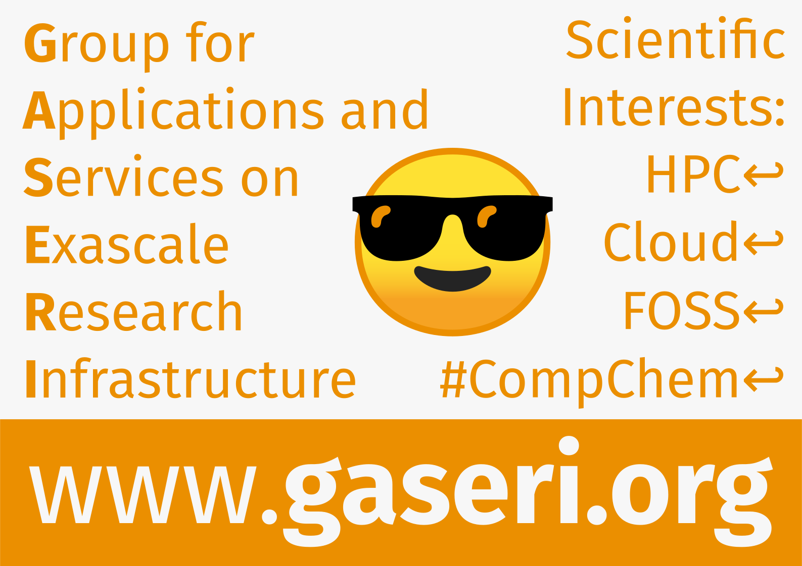

# Identitet

## Logotip

[Preuzimanje GASERI logotipa u vektorskom formatu SVG](../../images/gaseri-logo.svg)

[Preuzimanje GASERI logotipa s tekstom u vektorskom formatu SVG](../../images/gaseri-logo-text-paths.svg)

[Preuzimanje GASERI postera u vektorskom formatu SVG](../../images/gaseri-poster-paths.svg)

Za druge sheme boja i sezonske logotipe pregledajte [direktorij `docs/images` u repozitoriju našeg web sjedišta na GitHubu](https://github.com/gaseri/website/tree/main/docs/images).

## Himna

\[Pred-Refren\]  
Oni sve bi dali (Oni sve bi dali, oni sve bi dali, oni sve bi dali)  
Da vide da smo pali (Da smo pali)  
Samo gazi, gazi, gazi

\[Refren\]  
Skupi kao PSG, ovi ostali su žasu  
Zadnja vuča - BMW, ovi moji svi u gasu  
Oko mene moji ljudi, po-podižemo masu  
Na nastupu odvaljen, bato, opet skidam masku

Izvori: [Đ-SHOCK - PSG (Official Music Video) - YouTube](https://youtu.be/MxLrxXu10YY), [Đ-Shock (SRB) – PSG Lyrics | Genius](https://genius.com/Shock-srb-psg-lyrics)
